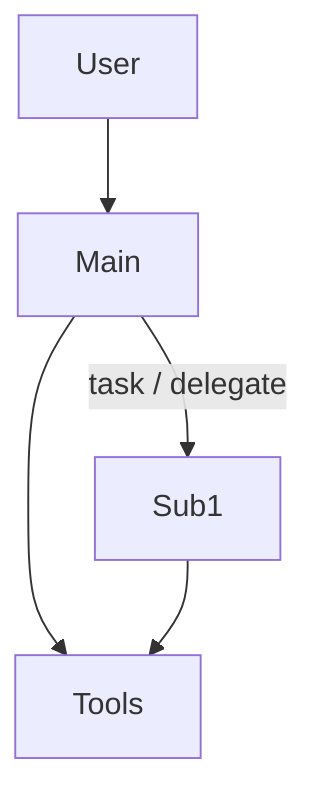

# Agent Harness — [Название продукта / имя harness]

> Контракт агентной платформы: как конфигурируем, запускаем, наблюдаем и оцениваем агента.
> **Шаблон:** заполни все разделы. Удали инструкции в `[]` после заполнения.
> Решения по стеку — из утверждённого [профиля](../../profiles/README.md) или явного отклонения. Не копируй чужой продукт.

Связанные документы: [vision.md](vision.md), [generation.md](generation.md), [rag.md](rag.md), [agent-security.md](agent-security.md), [api-contracts.md](api-contracts.md), [data-model.md](data-model.md).

**Когда обязателен:** в продукте есть LLM-агент (диалог, tool-calling, оркестрация). Если агентов несколько — один файл на продуктовый harness плюс общий раздел «платформа» в первом файле или в `vision.md`.

| Поле | Значение |
|------|----------|
| Профиль (если брали) | `[agent-platform-v1 / — / частично]` |
| Что из профиля отклонили | `[перечень развилок или «нет»]` |

---

## 1. Назначение и границы

[2–3 предложения: какую работу делает этот harness, для какой роли.]

**Делает:**

- …

**Не делает / вне scope этой версии:**

- …

---

## 2. Топология агентов

[Кто main, кто subagent, кто вызывается параллельно. Один агент — тоже нарисовать.]

| Узел | Роль | Свой фреймворк? | Свои промпты? |
|------|------|:---------------:|:-------------:|
| **[main]** | [оркестратор / единственный агент] | [да / нет] | [да / нет] |
| **[subagent]** | [изолированная задача] | [да / нет] | [да / нет] |

---

## 3. Платформа и пакеты

Как отделяем переиспользуемый runtime от продуктового harness.

| Слой | Что лежит | Новый harness копирует? |
|------|-----------|-------------------------|
| Платформа | factory, registry, runtime protocol, stream mapper, общие tools | нет |
| Этот harness | промпты, skills, builders, доменные обёртки | своя папка |

[Путь в репозитории, правило изоляции: harness не импортируют друг друга.]

---

## 4. Реестр конфигураций и билдеры

Как UI и runner узнают, кого запустить.

| Решение | Выбор |
|---------|-------|
| Где реестр | [код / БД / CMS] |
| Что отдаём UI | [id, name, description, …] |
| Что только runner видит | [benchmark-only id / нет] |
| Поле `framework` в API | [нет — диспетчер по `config_id` / есть] |
| Добавление конфига | [что править: одна запись + одна build-функция] |

Каждый `config_id` указывает на **одну** factory-функцию. Разные конфиги могут быть на разных фреймворках и со своими промптами — без смены контракта UI.

---

## 5. Контракт рантайма

Не привязывать к конкретному фреймворку. Зафиксировать операции:

| Операция | Есть? | Что возвращает |
|----------|:-----:|----------------|
| `invoke` | [да / нет] | [финальный ответ + usage] |
| `stream` | [да / нет] | [поток продуктовых событий, см. generation.md] |
| `cancel` | [да / нет] | [как клиент останавливает run] |
| `context_usage` | [да / нет] | [кто считает: runtime, не UI] |

Точка входа: какие идентификаторы **контекста задачи** агент получает (пользователь, документ, тикет, …). Не перечислять сюда все поля внешней системы — только то, без чего агент не стартует.

---

## 6. Путь к LLM

Отдельная развилка, не строка «есть OpenRouter» в таблице стека.

| Вопрос | Решение |
|--------|---------|
| SDK / библиотека | [прямой SDK провайдера / LangChain / свой адаптер / …] |
| Прокси / gateway | [нет / OpenRouter / LiteLLM / Azure / свой] |
| Где крутятся чат-модели | [внешний API / локально / гибрид] |
| Каталог моделей в UI | [перечень или ссылка на registry] |
| Модели только для runner | [перечень / нет] |
| Reasoning / structured output | [как включаем, кто не умеет] |
| Эмбеддинги и rerank | [тот же хост / отдельно — см. rag.md] |
| Секрет и биллинг | [какой ключ, fail-fast при отсутствии] |
| Что ломается при смене провайдера | [роутинг, usage, reasoning, …] |

---

## 7. Промпт-менеджмент

| Вопрос | Решение |
|--------|---------|
| Source of truth | [файлы в git / Langfuse Prompt Management / гибрид: git канон] |
| Версионирование и ревью | [PR в репозитории / версии в CMS] |
| Кто меняет промпт в проде | [роль] |
| Общие vs per-config | [общие, пока не разойдутся / сразу per-model] |
| Язык system / user-facing | [например: system — язык команды; ответы пользователю — язык продукта] |

Пути к файлам или именам промптов в CMS: `[…]`.

---

## 8. Инструкции агенту: промпты и skills

| Форма | Берём? | Когда так, а не иначе |
|-------|:------:|------------------------|
| Только system prompt | [ ] | [короткая роль, нет длинных алгоритмов] |
| Prompt + skills по требованию | [ ] | [длинные процедуры, шкалы, сценарии] |
| Prompt + всегда загруженные skills | [ ] | [малый набор, всегда нужен] |
| Иное (playbook, few-shot в датасете) | [ ] | […] |

Правило нарезки: **skill** — если есть алгоритм, шкала, формат поля, отдельный сценарий. **Абзац в промпте** — роль, границы, тон, запреты.

Что инжектим в первый ход: `[идентификаторы задачи / текст документа / каталог tools / список skills / ничего кроме user text]`.

---

## 9. Каталог инструментов

Для каждого tool — строка. JSON-ответы и ошибки — ниже или в приложении.

| Tool | Кто вызывает | Аргументы | Зачем | Типичная ошибка |
|------|--------------|-----------|-------|-----------------|
| `[name]` | [main / sub / оба] | `[…]` | [одно предложение] | [не найден / идёт индекс / …] |

### 9.1. Слой MCP вокруг продуктовых tools

Это **не** MCP агента-разработчика (документация библиотек в IDE). Речь о runtime продукта.

| Вопрос | Решение |
|--------|---------|
| Продуктовые tools | [только in-process / обёрнуты в MCP / гибрид] |
| Если MCP | [один сервер / несколько; какая auth] |
| Что торчит наружу | [перечень] |
| Если не MCP | [почему сейчас; триггер завести: второй потребитель-агент] |

---

## 10. Память и три контура

Три разные ленты. Не сливать в одну «историю».

| Контур | Назначение | Где лежит | Кто пишет |
|--------|------------|-----------|-----------|
| Видимая история чата | Reload UI, trace-карточки | [наши таблицы / …] | [backend при событиях, см. generation.md] |
| Контекст агента | Resume между ходами | [checkpointer фреймворка / своё / нет] | [фреймворк / мы] |
| Observability | Отладка, приёмка, eval | [Langfuse / иное] | [нативный callback фреймворка] |

Observability **не** заменяет чат и **не** является checkpointer'ом.

Дополнительно решить:

| Вопрос | Решение |
|--------|---------|
| Рабочая память внутри run | [todos / scratchpad / эфемерный VFS / нет] |
| Долговременная память (cross-thread, user memory) | [нет / да — где и как попадает в контекст] |
| Сжатие контекста | [встроенное фреймворка / своё / нет] |

Связь чата с checkpoint: `[поле thread_id / нет связи / …]`. Детали таблиц — в [data-model.md](data-model.md).

---

## 11. Мультимодальность

Даже если ответ «не принимаем» — записать.

| Вопрос | Решение |
|--------|---------|
| Вход | [только текст / изображения / файлы / аудио] |
| Где в UI и в API | [есть / нет] |
| Хранение бинарников | [object storage / inline / ссылка внешней системы / не храним] |
| Как в LLM за один ход | [vision parts / описание / отдельный tool] |
| Следующие ходы диалога | [ссылка / повторная загрузка / выбрасываем] |
| Трейс | [что в UI-истории; что в observability; сырые байты — да/нет] |
| Лимиты | [размер, число вложений, неподдерживаемый тип] |

---

## 12. Наблюдаемость и оценка

| Вопрос | Решение |
|--------|---------|
| Как трасса попадает в систему наблюдения | [нативный callback / свой экспортёр — обычно не надо] |
| Атрибуты trace | `[user / chat / config / задача]` |
| UI-события в observability | [нет, только нативный трейс / да] |
| Eval-контур | [есть отдельный roadmap-eval / нет] |
| Датасет, runner, метрики | [ссылки] |

---

## 13. Уровень защиты

Краткая фиксация. Методы и таблица угроз — в [agent-security.md](agent-security.md).

| Вопрос | Решение |
|--------|---------|
| Уровень этой версии | [только промпт / промпт + by-design / guards / HITL] |
| Документ | [agent-security.md](agent-security.md) |

---

## 14. Открытые вопросы

| Вопрос | Когда решать |
|--------|--------------|
| … | … |
