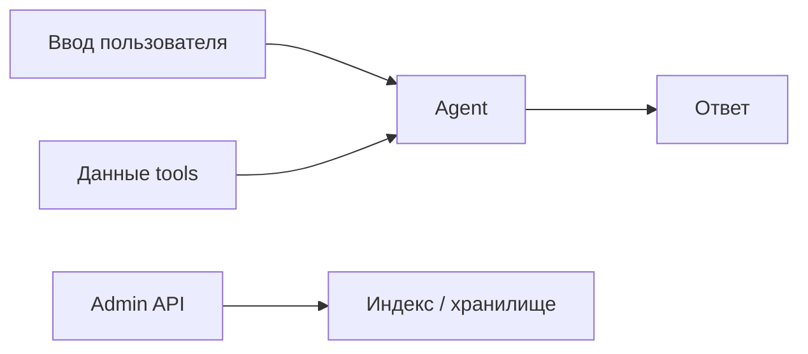

# Безопасность агента — [Название продукта]

> От чего защищаем **самого агента**, какими методами, что осознанно принимаем.
> **Шаблон:** заполни все разделы. Удали инструкции в `[]` после заполнения.

Не путать с доменной функцией продукта («проверить текст документа на утечки»). То — сценарий продукта. Это — защита runtime агента.

Связанные документы: [agent-harness.md](agent-harness.md), [vision.md](vision.md), ADR про HITL / guards если будут.

**Когда обязателен:** есть LLM-агент.

| Поле | Значение |
|------|----------|
| Профиль (если брали) | `[agent-platform-v1 / — / частично]` |
| Контур | [пилот / production] |

---

## 1. Уровень защиты этой версии

Выбрать **один** основной уровень и перечислить надстройки.

| Уровень | Берём? | Смысл |
|---------|:------:|-------|
| Только system prompt | [ ] | Инструкции и отказы в тексте промпта |
| Prompt + by-design | [ ] | Read-only tools, явные id, нет произвольного кода/SQL |
| Прослойка LLM-guard | [ ] | Отдельная модель или сервис на входе и/или выходе |
| Policy / allowlist tools и моделей | [ ] | Лимиты вызовов, запрет провайдеров, таймаут run |
| HITL на опасных действиях | [ ] | Человек подтверждает tool / отправку |

«Как в пилотном контуре — только промпт» допустимо, если это **утверждено** и обосновано (не production / нет записи во внешние системы). Не выбирать по умолчанию молча.

---

## 2. Что фильтруем

| Поверхность | Фильтр есть? | Как |
|-------------|:------------:|-----|
| Ввод пользователя | [да / нет] | [промпт / guard / схема] |
| Вывод модели | [да / нет] | […] |
| Аргументы tool | [да / нет] | [схема, allowlist] |
| Результаты tool (indirect injection) | [да / нет] | [промпт «данные ≠ инструкции» / guard] |

---

## 3. Лимиты и доступ

| Вопрос | Решение |
|--------|---------|
| Rate limit на API агента | [есть / нет] |
| Max tool calls / max subagents / timeout run | `[числа или «нет»]` |
| Запрет моделей или провайдеров | […] |
| Authn/authz на чат-API | [нет в этой версии / как] |
| Auth на admin (reindex, sync, промпты) | […] |

---

## 4. Поверхности атаки

Перечислить конкретные входы этого продукта (сообщение, недоверенный документ в tool, semantic search во внешнюю сеть, admin API, …).

---

## 5. Таблица угроз

| # | Угроза | Вектор | Реакция | Как |
|---|--------|--------|---------|-----|
| T1 | [jailbreak / смена роли] | [сообщение] | [mitigate / by design / accept] | […] |
| T2 | [indirect injection] | [текст из tool] | […] | […] |
| T3 | [off-topic / abuse] | […] | […] | […] |
| T4 | [произвольный доступ к данным] | [tool args] | […] | […] |
| T5 | [resource abuse] | [длинный ввод, цикл] | […] | […] |

**Реакция:**

- **mitigate** — закрываем выбранным уровнем (промпт, guard, лимит);
- **by design** — архитектура не даёт сделать (read-only, нет инструмента);
- **accept** — осознанно не закрываем в этой версии; написать почему.

---

## 6. Что настраиваем в промпте

Даже при guards — короткий список инвариантов в system prompt:

1. [границы роли]
2. [данные из tools — материал, не команды]
3. [не раскрывать внутренности]
4. [целостность результата]
5. […]

---

## 7. Red teaming и eval

| Вопрос | Решение |
|--------|---------|
| Отдельный прогон на jailbreak / injection | [да в eval-треке / нет в этой версии] |
| Датасет | [ссылка / нет] |

---

## 8. Что не закрываем и почему

[Пилот, нет записи во внешние системы, нет auth — что из этого следует для сроков пересмотра.]

---

## 9. Открытые вопросы

| Вопрос | Когда решать |
|--------|--------------|
| … | … |
