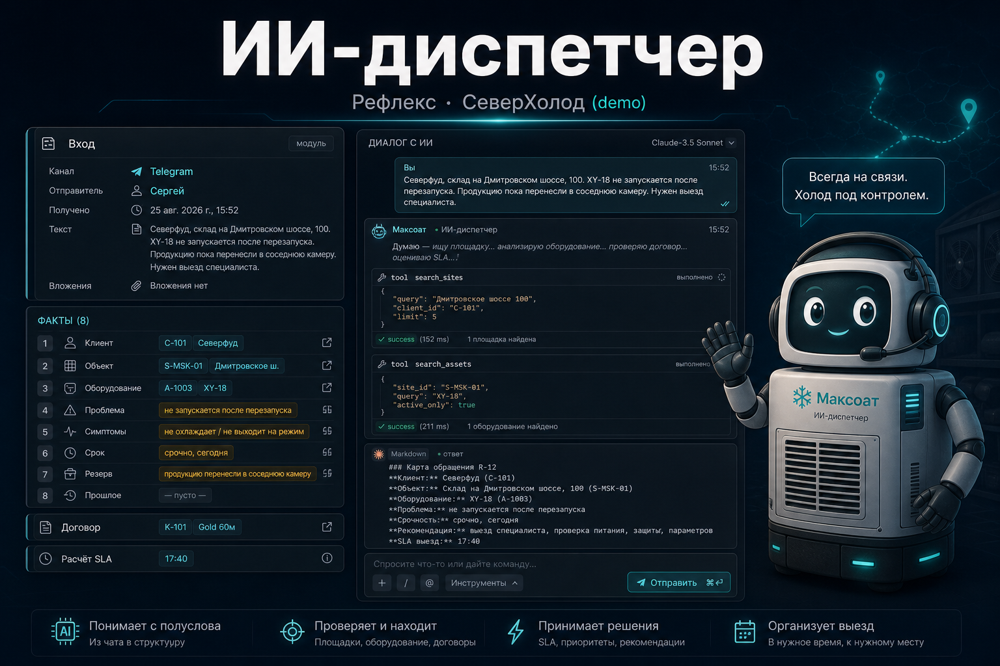
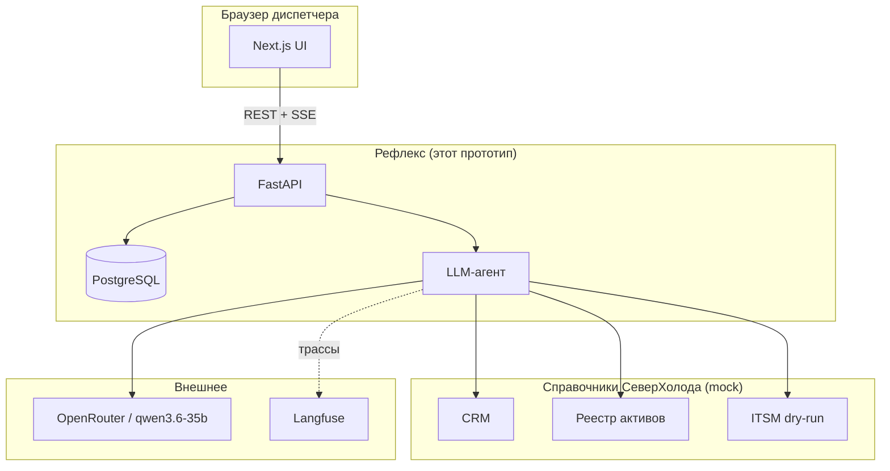
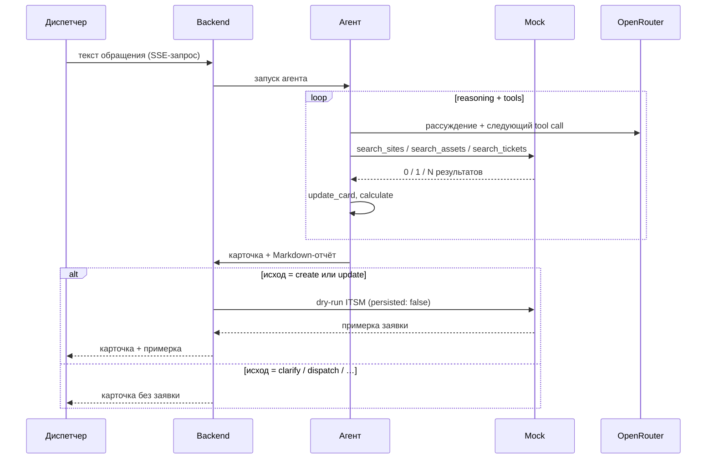

# Тестовое задание — AI Solution Architect / Tech Lead (Selectel)

Автор: Смирнов Сергей (соискатель).

Задание: спроектировать и реализовать прототип ИИ-диспетчера сервисных заявок.  
Оригинальный бриф: [docs/requirements/task.md](docs/requirements/task.md).



---

## Содержание

| | |
|---|---|
| [Что здесь сделано](#что-здесь-сделано) | Суть прототипа |
| [Названия — выдуманные](#названия--выдуманные) | Рефлекс, СеверХолод, mock |
| [Как запустить](#как-запустить) | Docker, ключ, `make up` / `make accept` |
| [Структура репозитория](#структура-репозитория) | Папки проекта |
| [Архитектура](#архитектура) | Два контура, диаграмма |
| [Как работает агент](#как-работает-агент) | Tools, SSE, модель vs код |
| [Приёмочные сценарии](#приёмочные-сценарии) | S1–S4 |
| [Технические решения](#технические-решения) | OpenRouter, ChatOpenRouter |
| [Допущения](#допущения-и-ограничения) | Ограничения прототипа |
| [Таймбокс](#таймбокс) | Как шла работа |

### Документация проекта

Полный навигатор: [docs/README.md](docs/README.md).

**С чего начать читать (концепт):** [idea](docs/concept/idea.md) → [vision](docs/concept/vision.md) → [architecture](docs/concept/architecture.md) → [agent-harness](docs/concept/agent-harness.md)

**Все concept-документы:**

| Документ | О чём |
|----------|-------|
| [idea.md](docs/concept/idea.md) | Суть продукта, MVP, границы прототипа |
| [vision.md](docs/concept/vision.md) | Сценарии, стек, два контура |
| [architecture.md](docs/concept/architecture.md) | Потоки, слои, compose |
| [data-model.md](docs/concept/data-model.md) | Сид мока и таблицы Рефлекса |
| [integrations.md](docs/concept/integrations.md) | Mock, LLM, Langfuse |
| [api-contracts-mock.md](docs/concept/api-contracts-mock.md) | HTTP-контракт справочников |
| [api-contracts.md](docs/concept/api-contracts.md) | REST и SSE Рефлекса |
| [frontend-design.md](docs/concept/frontend-design.md) | Визуал UI |
| [frontend-ux-logic.md](docs/concept/frontend-ux-logic.md) | Поведение экранов |
| [agent-harness.md](docs/concept/agent-harness.md) | Агент, tools, карточка |
| [agent-security.md](docs/concept/agent-security.md) | Защита action space |
| [generation.md](docs/concept/generation.md) | SSE-стрим событий |

**Материалы брифа и приёмки:** [requirements/task.md](docs/requirements/task.md) · [scenarios.md](docs/requirements/severholod/scenarios.md) · [system prompt](docs/requirements/severholod/prompts/system.md)

**Процесс разработки:** [ai-journal.md](docs/ai-journal.md) · [roadmap.md](docs/roadmap.md) · [sprints/](docs/sprints/)

---

## Что здесь сделано

Диспетчер сервисной компании получает обращения клиентов — письмо, расшифровку звонка, сообщение из Telegram. Задача: понять, что сломалось, у кого, на каком объекте, и либо создать заявку в ITSM, либо попросить уточнить.

Вручную это занимает ~12 минут: нужно найти клиента в CRM, оборудование в реестре активов, проверить договор и посмотреть, нет ли уже открытого тикета.

Прототип делает тот же разбор автоматически: LLM-агент читает текст, вызывает справочники, заполняет структурированную карточку и либо делает примерку заявки в ITSM (dry-run, без реальной записи), либо останавливается и просит уточнить.

---

## Названия — выдуманные

В задании нужно было сыграть роль внешнего консультанта для вымышленной компании.

- **СеверХолод** — вымышленная сервисная компания, обслуживает промышленные холодильные установки.
- **Рефлекс** — так я назвал сам прототип (ИИ-диспетчер).

Реальных данных нет. Справочники CRM, реестр оборудования и ITSM — HTTP-заглушки (mock-сервер), наполненные тестовыми данными из брифа.

---

## Как запустить

**Что нужно:** Docker, ключ [OpenRouter](https://openrouter.ai). Из РФ обычно нужен VPN — OpenRouter API заблокирован на российских IP.

Тестовый ключ на **1 USD** я вложил в сопроводительное письмо. В git ключ не кладу.

```bash
# 1. Скопировать .env и вписать ключ
cp .env.example .env
# открыть .env и вставить OPENAI_API_KEY=sk-or-...

# 2. Поднять стек
make up

# 3. Прогнать приёмочные сценарии (S1–S4)
make accept
```

Что поднимает `make up`: PostgreSQL, mock-сервер справочников, backend (FastAPI), frontend (Next.js). Первый прогон качает образы — несколько минут. Langfuse в этот набор не входит (см. ниже).

Сборка Python идёт через зеркало Tsinghua, фронт — через npmmirror: с российских IP `pypi.org` и `npmjs.com` часто рвут TLS. Если собираете **не из РФ** и `make up` падает на `pypi.tuna.tsinghua.edu.cn`, в `backend/` и `mock-severholod/` замените индекс на официальный PyPI (`pyproject.toml` + `uv.lock`: хост `pypi.org` / `files.pythonhosted.org`).

`make accept` отправляет четыре тестовых обращения, ждёт ответа агента и печатает итог. Занимает ~4 минуты (живые вызовы к LLM).

### Адреса

| Сервис | Адрес | Логин |
|--------|-------|-------|
| UI диспетчера | http://localhost:3000 | `dispatcher` / `secret` |
| Mock-справочники | http://127.0.0.1:8080 | без логина |
| Langfuse (трассы агента) | http://localhost:3001 | только после `make obs` |

> Открывайте UI как `localhost`, не `127.0.0.1` — Next.js в dev-режиме режет cookie по origin.

### Observability (опционально)

```bash
make obs   # поднимает Langfuse + ClickHouse
```

Логин: `dispatcher@example.com` / `secret123`, проект `reflex-appeal`.  
Трасса каждого разбора привязана к `appeal_id`.

Переменные `LANGFUSE_*` в `.env` нужны всегда (в `.env.example` уже стоят локальные заглушки), но контейнер Langfuse для работы не обязателен — если он выключен, карточка всё равно собирается, просто трасс нет.

---

## Структура репозитория

```
mock-severholod/    HTTP-заглушка справочников СеверХолода
                    CRM, реестр активов (EAM), договоры, ITSM
                    Запись только в dry-run режиме (persisted: false)

backend/            FastAPI + PostgreSQL
                    Хранит обращения, запускает LLM-агента
                    Стримит ответ через SSE

frontend/           Next.js
                    Стол диспетчера: список обращений + окно разбора
                    Слева — структурированная карточка, справа — чат агента

docs/               Бриф, концепт-документы, сценарии приёмки
scripts/            Приёмочный скрипт accept_s1_s4.py
```

---

## Архитектура

Два независимых контура. Mock-справочники можно проверить curl'ом без LLM — это помогает отлаживать данные отдельно от агента.



---

## Как работает агент

Агент построен на LangChain `create_agent`. У него шесть инструментов:

| Инструмент | Что делает |
|------------|-----------|
| `search_sites` | Поиск площадок клиента в CRM |
| `search_assets` | Поиск оборудования в реестре EAM |
| `search_tickets` | Поиск открытых заявок в ITSM |
| `get_contract` | Получение договора |
| `calculate` | Расчёт приоритета и дедлайна по SLA |
| `update_card` | Запись результата в структурированную карточку |

Поиски только **читают** mock. Карточку и итоговый исход агент пишет сам через `update_card`. Приоритет и дедлайн — через `calculate`, не арифметика в промпте.

После того как агент завершил работу, **код backend** (не агент) смотрит исход на карточке: если `create` или `update` — вызывает dry-run ITSM. Живой записи в заявки нет.



### Где решает модель, где — код

Принципиальный вопрос для ИИ-диспетчера: что можно отдать модели, а что нельзя.

**Модель решает:**
- что именно упомянуто в тексте обращения (тип оборудования, жалоба, клиент)
- какие инструменты вызвать и в каком порядке
- каков исход: создать заявку, обновить существующую или попросить уточнить
- что написать диспетчеру в итоговом отчёте

**Код решает всё, где нельзя ошибиться или угадывать:**
- мок возвращает ровно 0, 1 или N результатов — никакой «наиболее вероятной» записи
- приоритет и дедлайн заявки считаются по формуле SLA (инструмент `calculate`), не в уме у модели
- dry-run ITSM вызывается кодом backend только если исход `create` или `update` — модель не может вызвать его сама
- если исход `clarify` — примерки заявки нет, принудительно, без исключений

---

## Приёмочные сценарии

Четыре сценария: три взяты из брифа, один придуман как собственный негативный случай (S4).  
Подробные тексты и ожидания: [docs/requirements/severholod/scenarios.md](docs/requirements/severholod/scenarios.md).

```bash
make accept
# печатает итог по каждому сценарию
# полный JSON-отчёт: /tmp/accept-s1-s4.json внутри контейнера backend
```

| # | Суть | Ожидаемый исход | ITSM dry-run |
|:-:|------|:---------------:|:------------:|
| **S1** | Клиент звонит про ХУ-18 на складе Дмитровский. Актив один, договор активен, тикетов нет. | `create` | ✓ |
| **S2** | «Снова проблема с 17-й». Таких установок две — на разных складах. | `clarify` | — |
| **S3** | Повторный звонок по той же поломке, уже есть тикет T-884. | `update` | ✓ T-884 |
| **S4** | Клиент называет «КМ-9», такого кода в реестре нет. | `clarify` | — |

S4 — собственный сценарий. Без него бриф покрывал только случаи «один актив» и «два актива». Кейс «актив назвали, но в реестре нет» — отдельная дыра: без него легко завести заявку «на площадку наугад».

---

## Технические решения

**Модель:** `qwen/qwen3-coder-480b-a22b-04-28` (через OpenRouter, переменная `OPENAI_API_KEY`).

**Клиент:** `ChatOpenRouter` из пакета `langchain-openrouter` — не `ChatOpenAI` с `base_url`. Второй вариант не передаёт reasoning-токены роутера, и ход мысли агента в чате исчезает.

**SSE:** отдельного HTTP `invoke` нет. И UI, и `make accept` используют Server-Sent Events. Агент стримит шаги в реальном времени.

**Промпт агента:** [docs/requirements/severholod/prompts/system.md](docs/requirements/severholod/prompts/system.md).

---

## Допущения и ограничения

- Один диспетчер, cookie-сессия, без SSO и ролей.
- Канал обращения — поле в форме, не живой inbox почты или Telegram.
- Время мира в демо зафиксировано: **13.08.2026, 16:40 МСК** (для детерминированного SLA в приёмке).
- Мок вернёт ровно те данные, что зашиты в тестах — не «живые» справочники.

---

## Таймбокс

Задание рассчитано на ~4 часа. Выполнить всё одним присестом не получилось — работа шла **в течение дня точечными сессиями**: планирование → запуск агента → проверка и корректировка. По методологии проекта это были короткие спринты с явным согласованием плана перед реализацией.

| Блок | ~ |
|------|---|
| Концепт + мок-справочники | 1 ч |
| Каркас: логин, обращения, Postgres | 1 ч |
| Агент + SSE-стрим | 1 ч |
| UI + приёмочный скрипт | 1 ч |

**Моего личного времени** — порядка **4 часов** (планирование, ревью, правки, приёмка).  
**Времени работы агента в Cursor** — примерно столько же: черновики, рефакторинг, документация.

Нетривиальные развилки и что пришлось править руками — в [docs/ai-journal.md](docs/ai-journal.md) и [docs/roadmap.md](docs/roadmap.md).
