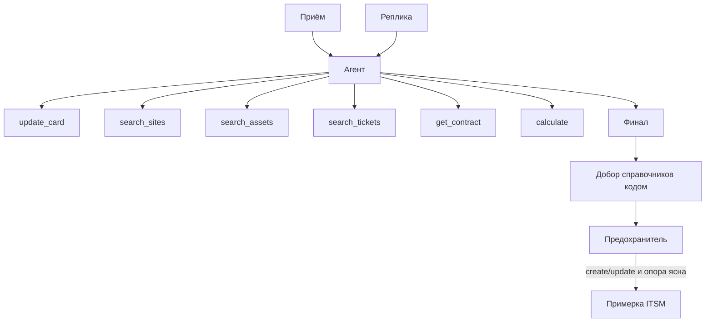

# Agent Harness — Рефлекс

> Канон поведения заказчика: [docs/requirements/severholod/harness.md](../requirements/severholod/harness.md). Здесь — форма методологии, без второго каталога JSON тулов.

| Поле | Значение |
|------|----------|
| Профиль | частично `agent-platform-v1` |
| Отклонили | RAG; субагенты; MCP наружу; Deep Agents / VFS; полный `card` в `response_format`; Stop; выбор модели в UI |

---

## 1. Назначение и границы

Один прогон разбирает одно обращение: факты, поиски, один исход, реплика в чат.

**Делает:** упоминания, поиск справочников (только чтение), запись карточки через `update_card`, расчёт SLA отдельным `calculate`, финал модели, примерка ITSM кодом после прогона.

**Не делает:** письмо клиенту, назначение группы, склейка ниток, тул `commit_decision`, create_ticket из модели.

---

## 2. Топология

Один main. Субагентов нет.

| Узел | Роль | Свой фреймворк | Свои промпты |
|------|------|:--------------:|:------------:|
| Агент разбора | единственный цикл | нет | да, один system |

---

## 3. Платформа

Пилот — один продукт. Платформы на много harness нет.

| Слой | Что лежит |
|------|-----------|
| Рантайм | LangChain `create_agent` + `ChatOpenRouter`, `astream_events` v3, SSE |
| Этот harness | system, тулы, расчёт, предохранитель |

Путь: `backend/` когда появится каркас. Чужих агентов нет.

---

## 4. Реестр

Один конфиг в коде: `reflex-appeal`. UI не выбирает.

---

## 5. Контракт рантайма

| Операция | Есть? | Что возвращает |
|----------|:-----:|----------------|
| `invoke` | да | card, последнее сообщение, usage |
| `stream` | да | события generation |
| `cancel` | нет | прогон короткий |
| `context_usage` | да, если провайдер дал | считает backend |

Старт без `appeal_id` невозможен. Карточка живёт в Postgres, не в чекпоинтере LangGraph. Первый user — собранный вход, не сырой JSON. В ход — актуальный `card`.

Прогон — `create_agent` без чекпоинтера LangGraph: карточка и лента в Postgres. Стрим — `astream_events(..., version="v3")`. Модель — `ChatOpenRouter`, reasoning `effort` (не бюджет `max_tokens` мысли). Финал — `response_format=ToolStrategy(Finale)` (`structured_response`); запасной разбор JSON из текста. После guard, если модель не дала markdown, runner пишет `message_final` из карточки. `thread_id` в config только для трассы Langfuse, не для памяти графа. Обрыв стрима или пустой финал — тонкий guard по уже накопленной `card` (без тихого добора справочников). Тихого `complete_catalog` нет.

---

## 6. Путь к LLM

| Вопрос | Решение |
|--------|---------|
| SDK | LangChain `ChatOpenRouter` (`langchain-openrouter`) |
| Gateway | прямой OpenAI-compatible, LiteLLM нет |
| Где модели | внешний API |
| Каталог в UI | нет |
| Structured output | короткий финал, не весь card |
| Эмбеддинги | нет |
| Секрет | Settings, fail fast |
| Смена провайдера | имя и base URL |

Рассуждения провайдера в чат показываем, если пришли. На исход не влияют.

---

## 7. Промпт-менеджмент

Файл в git: [prompts/system.md](../requirements/severholod/prompts/system.md). Langfuse промпты не отдаёт. Язык system и ответов — русский.

Текущий текст — черновик намерений. **В sprint 04 не копировать как есть:** переписать skill'ом `agent-harness-construction` (action space, наблюдения тулов, когда останавливаться). Поведение и исходы не менять без правки card/regulations.

---

## 8. Инструкции

Только system + правила слотов в card. Skills файлов агенту не грузим (YAGNI). В первый ход: `appeal_id`, `card`, вход в user.

---

## 9. Каталог инструментов

Шесть тулов. Форма ответа: `status`, `summary`, `next_actions`, `artifacts`, `result` — как в пакете заказчика.

| Tool | Кто | Аргументы | Зачем | Типичная ошибка |
|------|-----|-----------|-------|-----------------|
| `update_card` | агент | UpdateCardInput | единственная запись карточки | fact без цитаты; id не из поиска |
| `search_sites` | агент | как GET sites | клиент и площадки, только чтение | пустой фильтр; имя человека вместо организации |
| `search_assets` | агент | как GET assets | оборудование, только чтение | несколько совпадений — выбрать самому |
| `search_tickets` | агент | как GET tickets, обязателен asset_id | открытые заявки, только чтение | вызов без актива |
| `get_contract` | агент | обязательный site_id | договор, только чтение | ждать авторасчёт |
| `calculate` | агент | критичность, симптомы, срок, пояс | приоритет и дедлайн | считать цифры самому |

Привязку на карточке пишет агент через `update_card`. Схема — [schemas/update_card.py](../requirements/severholod/schemas/update_card.py). `card_updated` только после записи.

Тихого добора справочников после цикла нет: если модель не вызвала поиск, слот остаётся пустым, финал без опоры не может быть `create`/`update`. Угадывать город или id без ответа тула нельзя.

### 9.1. MCP

In-process обёртки над HTTP. Второй потребитель появится — тогда MCP.

---

## 10. Память

| Контур | Где | Кто пишет |
|--------|-----|-----------|
| Лента UI | `appeal_messages` | backend по стриму |
| Контекст агента | `appeals.card` + лента сообщений | тулы и runner |
| Observability | Langfuse | SDK + self-host v4 (`langfuse.langchain.CallbackHandler`); session = `appeal_id` |

Todos, VFS, память о диспетчере между обращениями — нет. Сжатие — только если фреймворк сам.

---

## 11. Мультимодальность

Только текст. Вложение — текстовое поле. Бинарники не храним.

---

## 12. Наблюдаемость

Один trace = один прогон. Мета: `appeal_id`, в конце `outcome`, `auto_in_prod`. Сессия Langfuse = обращение. Датасет — [roadmap-eval.md](../roadmap-eval.md).

---

## 13. Защита

Промпт + by-design. Подробно — [agent-security.md](agent-security.md).

---

## 14. Открытые вопросы

| Вопрос | Когда |
|--------|-------|
| Переработка system prompt и описаний тулов | сделано в sprint 04 |
| TodoListMiddleware | если на живых прогонах модель пропускает тулы |
| Точные формулы SLA | уже в [regulations.md](../requirements/severholod/regulations.md) |
