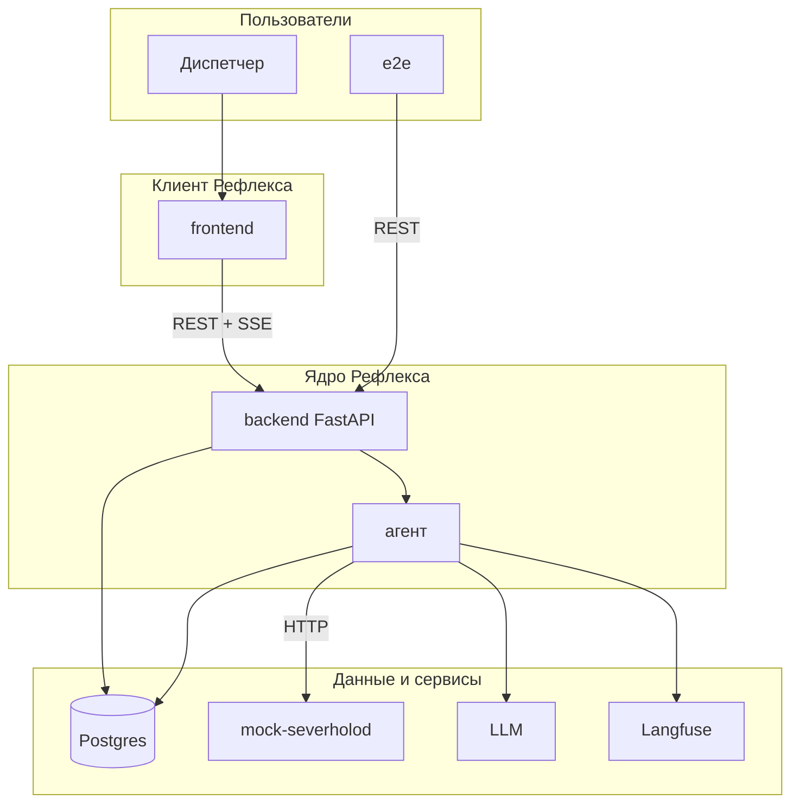
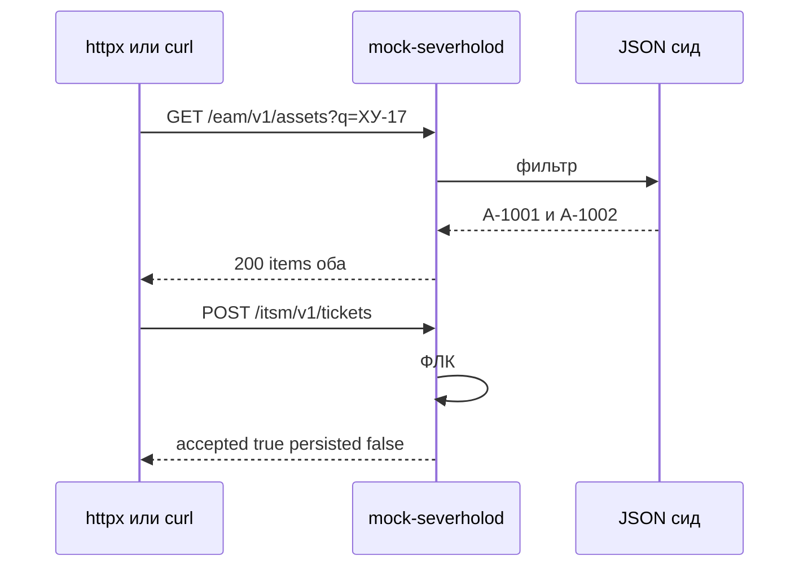
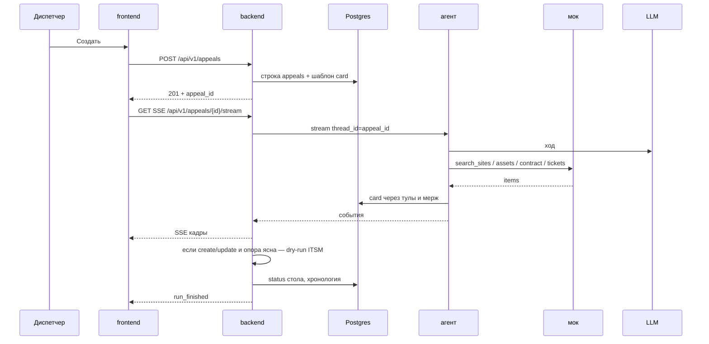
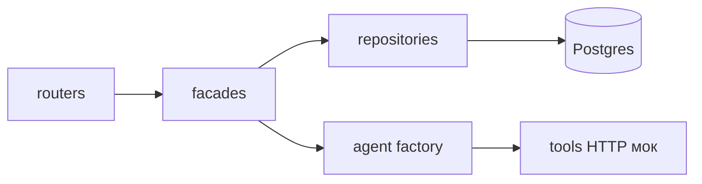
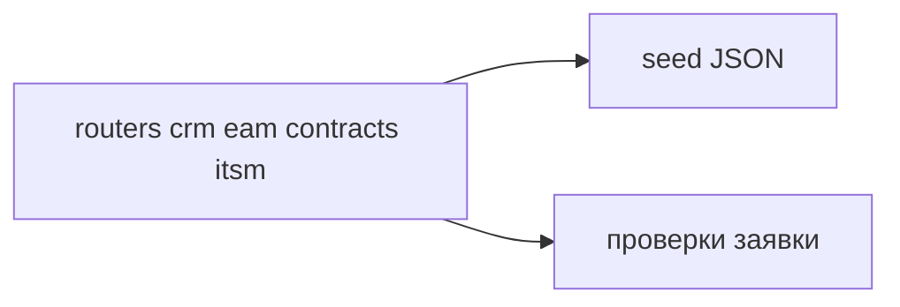

# Архитектура системы

> Видение — [vision.md](vision.md). Домен — [data-model.md](data-model.md).

---

## Контекст системы

Диспетчер работает в браузере. Бизнес-логика разбора — в backend Рефлекса. Справочники — в отдельном моке. LLM и Langfuse — снаружи контура объекта.

---

## Контейнеры и ответственность

| Компонент | Назначение | Технологии | Документация |
|-----------|-----------|-------------|--------------|
| **mock-severholod** | Справочники и dry-run ITSM | FastAPI, JSON-сид | [api-contracts-mock.md](api-contracts-mock.md), [ADR-0001](../adrs/0001-two-contours.md) |
| **backend** | Сессия, обращения, агент, SSE | FastAPI, LangChain, SQLAlchemy | [api-contracts.md](api-contracts.md) |
| **frontend** | Стол, журнал, карточка | Next.js, shadcn | [frontend-ux-logic.md](frontend-ux-logic.md) |
| **postgres** | Обращения Рефлекса + чекпоинтер | PostgreSQL 15+ | [data-model.md](data-model.md) |
| **langfuse** | Трассы | официальный образ | [integrations.md](integrations.md) |

Слои backend: **API → facade/service → repository → DB**. В Postgres из роутера не ходим. Мок: **router → in-memory/JSON store**, репозиторий над файлом сида, без ORM.

Транспорт стрима — **SSE**. Зафиксировано здесь, отдельный ADR не нужен.

---

## Поток: мок сам по себе

---

## Поток: новое обращение

Ленивого «чата без обращения» нет: обращение рождается на «Создать». Реплика диспетчера — новый `stream` на том же id.

---

## Backend — внутренняя структура

Роутер принимает HTTP. Facade ведёт обращение и прогон. Repository — единственный, кто пишет `appeals` и сообщения. Tools — тонкие обёртки над HTTP мока.

---

## Мок — внутренняя структура

Один процесс, четыре префикса URL. Отдельных микросервисов нет.

---

## Деплой — локально

`make up` / корневой `docker-compose`: `mock-severholod`, `backend`, `frontend`, `postgres`, `langfuse`. Рефлекс не стартует без `OPENAI_*` и `LANGFUSE_*`. Мок секретов не требует.

## Деплой — production

Нет. Пилот на машине кандидата / интервьюера.

---

## Связанные документы

- [vision.md](vision.md)
- [data-model.md](data-model.md)
- [api-contracts-mock.md](api-contracts-mock.md)
- [api-contracts.md](api-contracts.md)
- [integrations.md](integrations.md)
- [../adrs/](../adrs/)
