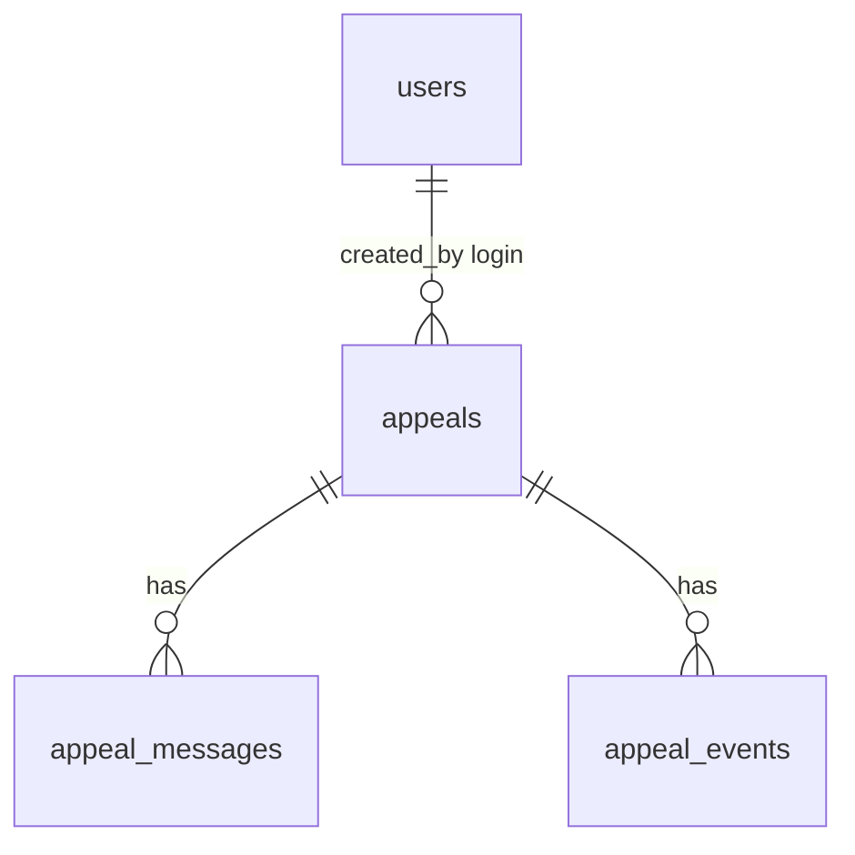

# Модель данных

> Два блока. Справочники объекта не копируем в Postgres Рефлекса.

---

## Что в нашей схеме и что нет

| Класс | В миграции Рефлекса? | Комментарий |
|-------|:--------------------:|-------------|
| UI-история чата | да | `appeal_messages` |
| Хронология снимков `card` | да | `appeal_events` |
| Контекст агента | нет — таблицы LangChain checkpointer в той же БД | не путать с лентой |
| Реестр агент-конфигов | нет — код `reflex-appeal` | |
| Домен СеверХолода | нет | живёт в моке |

---

## Блок A. Мок — не Postgres

Сид — один JSON (как в брифе + поля на T-884 из [api.md](../requirements/severholod/api.md)). Мок читает его в память при старте.

| Коллекция | Ключ | Зачем |
|-----------|------|--------|
| `sites` | `site_id` | CRM |
| `assets` | `asset_id` | EAM |
| `contracts` | `contract_id` | договоры |
| `tickets` | `ticket_id` | ITSM; при выключенных мутациях не меняется |

`current_time` в сиде — дата мира демо для людей, не метод API. Рефлекс считает SLA от `received_at` обращения.

Лог dry-run — список в памяти процесса, после рестарта пустой. Отдельная таблица не нужна.

---

## Блок B. Рефлекс — логическая модель

### Pilot user

Один пользователь из конфига, строка нужна чтобы журнал показал «кто создал».

| Поле | Тип | Описание |
|------|-----|----------|
| id | bigint | PK |
| login | text | уникальный |
| password_hash | text | не plaintext |
| created_at | timestamptz | |

### Appeal

| Поле | Тип | Описание |
|------|-----|----------|
| id | bigint | PK |
| status | text | `new` / `clarify` / `dispatch` / `approve` / `done` |
| run_status | text | `idle` / `running` |
| channel | text | email / telegram / call / lk |
| sender | text | nullable |
| received_at | timestamptz | фильтр журнала |
| text | text | вход |
| attachment_text | text | nullable |
| created_by | text | логин или `api` |
| card | jsonb | документ карточки |
| created_at | timestamptz | |

Публичный id в UI — `R-{id}`. Отдельная колонка не нужна.

Статусы стола мапятся так: `new` новые, `clarify` нужно уточнение, `dispatch` диспетчеру, `approve` на согласовании, `done` разобрано. Коды короче русских подписей UI.

### Appeal message

Видимая лента чата.

| Поле | Тип | Описание |
|------|-----|----------|
| id | bigint | PK |
| appeal_id | bigint | FK |
| author | text | `dispatcher` / `agent` / `system` |
| kind | text | `message` / `thought` / `tool_call` / `tool_result` |
| body | jsonb | текст или payload тула |
| created_at | timestamptz | |

### Appeal event

Хронология: создано / прогон закончен / реплика. Отката нет.

| Поле | Тип | Описание |
|------|-----|----------|
| id | bigint | PK |
| appeal_id | bigint | FK |
| type | text | `created` / `run_finished` / `dispatcher_reply` |
| card_snapshot | jsonb | nullable, полный card после прогона |
| created_at | timestamptz | |

Связь user → appeal не FK по id: создатель может быть `api`. Логин копируем строкой.

---

## Физическая модель

Соглашения: PK `BIGINT GENERATED ALWAYS AS IDENTITY`; строки `TEXT`; время `TIMESTAMPTZ`; статусы `TEXT` + `CHECK`; JSONB для `card`; индексы на FK вручную.

### users

| Колонка | Тип | Модификаторы |
|---------|-----|--------------|
| id | bigint | GENERATED ALWAYS AS IDENTITY PK |
| login | text | NOT NULL UNIQUE |
| password_hash | text | NOT NULL |
| created_at | timestamptz | NOT NULL DEFAULT now() |

### appeals

| Колонка | Тип | Модификаторы |
|---------|-----|--------------|
| id | bigint | GENERATED ALWAYS AS IDENTITY PK |
| status | text | NOT NULL CHECK IN (new, clarify, dispatch, approve, done) |
| run_status | text | NOT NULL CHECK IN (idle, running) DEFAULT idle |
| channel | text | NOT NULL CHECK IN (email, telegram, call, lk) |
| sender | text | NULL |
| received_at | timestamptz | NOT NULL |
| text | text | NOT NULL |
| attachment_text | text | NULL |
| created_by | text | NOT NULL |
| card | jsonb | NOT NULL |
| created_at | timestamptz | NOT NULL DEFAULT now() |

Индексы: `(status)`, `(received_at DESC)`, `(channel)`, `(run_status)` где `running` — частичный не обязателен в прототипе, обычный `(status, received_at DESC)` хватит для стола и журнала.

### appeal_messages

| Колонка | Тип | Модификаторы |
|---------|-----|--------------|
| id | bigint | GENERATED ALWAYS AS IDENTITY PK |
| appeal_id | bigint | NOT NULL REFERENCES appeals(id) ON DELETE CASCADE |
| author | text | NOT NULL |
| kind | text | NOT NULL |
| body | jsonb | NOT NULL |
| created_at | timestamptz | NOT NULL DEFAULT now() |

Индекс: `(appeal_id, created_at)`.

### appeal_events

| Колонка | Тип | Модификаторы |
|---------|-----|--------------|
| id | bigint | GENERATED ALWAYS AS IDENTITY PK |
| appeal_id | bigint | NOT NULL REFERENCES appeals(id) ON DELETE CASCADE |
| type | text | NOT NULL |
| card_snapshot | jsonb | NULL |
| created_at | timestamptz | NOT NULL DEFAULT now() |

Индекс: `(appeal_id, created_at)`.

Чекпоинтер LangChain — его таблицы, миграцией фреймворка или `setup()`. Не описываем.

---

## Покрытие сценариев

| Сценарий | Где данные | Запрос |
|----------|------------|--------|
| М-1 поиск ХУ-17 | мок `assets` | фильтр в памяти |
| Стол | `appeals` | GROUP/COUNT по status, не `done` |
| Журнал | `appeals` | фильтр status/channel/received_at |
| Карточка | `appeals.card` + messages | PK + ORDER BY created_at |
| Реплика | messages + тот же appeal | INSERT + новый прогон |

---

## Выбор СУБД

Рефлекс — PostgreSQL: JSONB карточки, лента, хронология, conventions проекта. Чекпоинтера фреймворка нет. Мок — JSON-файл: сид из брифа, YAGNI на вторую БД.

### Дальше

| Потребность | Решение |
|-------------|---------|
| Живые мутации ITSM | флаг мока, тот же JSON/память |
| Много диспетчеров | таблица users уже есть |
| Пагинация журнала | `id` + `received_at` уже индексируются |
