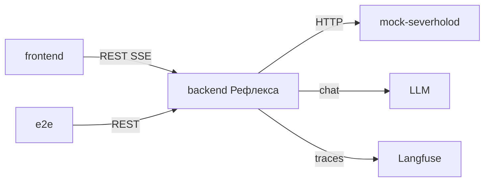

# Внешние интеграции

С точки зрения **Рефлекса**. Мок — соседний контур, который мы сами делаем; каталог методов — [api-contracts-mock.md](api-contracts-mock.md).

---

## 1. API Рефлекса

| Параметр | Значение |
|----------|----------|
| Назначение | UI и e2e: сессия, обращения, стрим |
| Направление | In |
| Протокол | HTTP REST + SSE |
| Базовый URL | `http://localhost:8000` |
| Документация | [api-contracts.md](api-contracts.md) |

---

## 2. Внешние системы

### mock-severholod

| Параметр | Значение |
|----------|----------|
| Назначение | CRM, EAM, договоры, ITSM read + dry-run |
| Направление | Out |
| Протокол | HTTP REST JSON |
| Критичность | MVP — без мока агент не разбирает |

Базовый URL из Settings (`MOCK_SEVERHOLOD_URL`). Timeout на каждый вызов (прототип: 5 с). 4xx/5xx → tool `error`; после двух ошибок одного справочника исход `dispatch`.

Мок в интернет не ходит.

### LLM

| Параметр | Значение |
|----------|----------|
| Назначение | Чат-модель агента |
| Направление | Out |
| Протокол | OpenAI-compatible HTTPS |
| Критичность | MVP |

`OPENAI_API_KEY` и `OPENAI_MODEL` в Settings. Клиент — `ChatOpenRouter` (пакет сам ходит на OpenRouter). `OPENAI_BASE_URL` Settings ещё требует, конструктор модели его не читает. Нет ключа — процесс не стартует. Из РФ до OpenRouter обычно нужен VPN.

### Langfuse

| Параметр | Значение |
|----------|----------|
| Назначение | Трассы прогона, потом датасет |
| Направление | Out |
| Протокол | HTTPS Langfuse SDK |
| Критичность | MVP |

`LANGFUSE_PUBLIC_KEY`, `LANGFUSE_SECRET_KEY`, `LANGFUSE_HOST` — без них Settings не поднимается. Живой контейнер для разбора не обязателен: нет handler — прогон идёт, трасс нет. Промпты из Langfuse не читаем. Локально — self-host v4 в compose (worker, ClickHouse, Redis, MinIO).

Почта, Telegram, очередь, настоящая CRM — не подключаем.

---

## 3. Диаграмма

---

## 4. Риски

| Интеграция | Риск | Митигация |
|------------|------|-----------|
| **мок** | Не запущен / 5xx | Tool error, исход dispatch, write нет |
| **LLM** | Таймаут, галлюцинация id | Timeout; id на карточку только через `update_card` после поиска |
| **Langfuse** | Упал хост | Прогон не валит карточку; трассы нет |

Для разбора критичны мок и LLM. Langfuse — наблюдаемость. Мок проверяем отдельно до Рефлекса.
