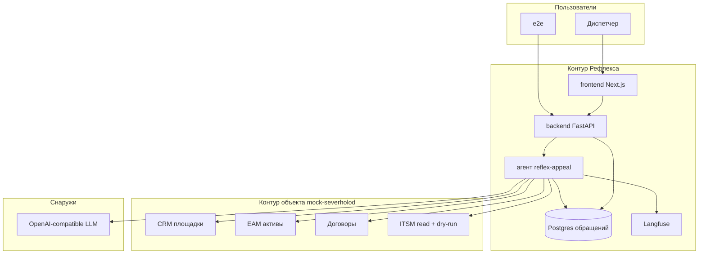

# Техническое видение — Рефлекс

> **Профиль:** частично `agent-platform-v1`.
> **Связанное:** [idea.md](idea.md), [architecture.md](architecture.md), пакет [severholod/](../requirements/severholod/).

---

## 1. Система в целом

Пилот — два сервиса в одном compose.

**Мок СеверХолода** притворяется CRM, реестром оборудования, договорами и ITSM. Отдаёт честный 0 / 1 / N. Заявки пишет только в dry-run, пока флаг не включён.

**Рефлекс** принимает обращение, крутит одного агента, рисует стол и карточку. Справочники не копирует к себе: ходит в мок по HTTP.

Ядро Рефлекса — FastAPI + LangChain (цикл tools, не Deep Agents). UI — Next.js. Хостинга нет.

---

## 2. Роли

| Роль | Описание |
|------|----------|
| **Диспетчер** | Единственный пользователь UI. Создаёт обращения, смотрит стол/журнал/карточку, дописывает факты в чат |
| **e2e / интервьюер** | Бьёт в API Рефлекса тем же входом, что форма. Мок дергает отдельно, пока Рефлекса ещё нет |

Клиент на объекте и сервисная группа в пилоте не пользователи.

---

## 3. Пользовательские сценарии

Группами по ТЗ и спеке. Датасет — [scenarios.md](../requirements/severholod/scenarios.md).

### Контур мока (без UI)

- **М-1: Поиск 0 / 1 / N** — `q=ХУ-17` без площадки отдаёт оба актива; с `site_id=S-MSK-01` — один.
- **М-2: Пустой поиск** — неизвестная фирма → `200` и `items: []`.
- **М-3: Договор** — по `S-MSK-01` один Gold; без площадки метод не гадает.
- **М-4: Dry-run create** — валидный payload → `accepted: true`, `persisted: false`, `would_ticket_id`.
- **М-5: Dry-run update** — PATCH T-884 проходит ФЛК; закрытый id — отказ.

### Диспетчер — вход и стол

- **С-1: Вход** — логин/пароль из конфига. Пустые поля не уходят. Неверная пара — сообщение на месте.
- **С-2: Стол** — четыре виджета: новые / нужно уточнение / диспетчеру / на согласовании. «Разобрано» только в журнале.
- **С-3: Создать обращение** — канал, отправитель, время, текст, текст вложения. Склейки нет: каждый раз новое дело.

### Диспетчер — разбор

- **С-4: S1 полный** — ХУ-18 на Дмитровском → create, примерка ITSM, статус «разобрано».
- **С-5: S2 неоднозначный** — две 17-х → clarify, без would-id.
- **С-6: S3 повтор** — Дмитровское + семнадцатая → update T-884.
- **С-7: S4 не найден** — КМ-9 на ясной площадке → clarify, заявку на площадку «на всякий случай» не заводим.
- **С-8: Реплика** — диспетчер пишет «это Дмитровское»; тот же `appeal_id`, пересчёт карточки.

### Журнал

- **С-9: Фильтры** — статус, канал, период по дате получения. Клик — та же карточка.

Отдельный `user-scenarios.md` не заводим: кейсы уже в пакете заказчика.

---

## 4. Архитектура (high-level)



Мок в LLM и Langfuse не ходит.

---

## 5. Компоненты системы

### Контур мока — `mock-severholod`

- Отдаёт HTTP из [api-contracts-mock.md](api-contracts-mock.md).
- Сид — JSON из брифа плюс явные поля на T-884.
- **Не делает:** inbox, исходящие, выбор «лучшей» площадки, расчёт SLA, LLM.
- **Статус:** MVP, делаем первым.

### Контур Рефлекса — backend

- Intake, журнал, карточка, сессия, запуск агента, SSE.
- **Не делает:** не пишет в таблицы мока; не шлёт клиенту.
- **Статус:** MVP, после мока.

### Контур Рефлекса — frontend

- Вход, стол, журнал, форма, карточка, чат.
- Не embeddable-пакет.
- **Статус:** MVP, после API Рефлекса.

### Агент `reflex-appeal`

- Один main. Пять тулов. Финал без двери. Примерка ITSM — код после прогона.
- **Статус:** MVP.

### Postgres Рефлекса

- Обращения, хронология, лента чата, пилотный пользователь. Чекпоинтера фреймворка нет.
- **Статус:** MVP.

### Langfuse

- Трассы и потом датасет S1–S4. Промпты оттуда не берём.
- **Статус:** MVP. Без `LANGFUSE_*` в `.env` Рефлекс не стартует. Живой контейнер для разбора не обязателен.

---

## 5a. Агент и LLM

| Вопрос | Короткий ответ | Документ |
|--------|----------------|----------|
| Есть агент | да, один конфиг `reflex-appeal` | harness |
| Runtime | `stream` в UI и в приёмке; отдельного `invoke` нет; cancel нет | generation |
| Путь к LLM | LangChain `ChatOpenRouter` (OpenRouter, не `ChatOpenAI` + base_url) | harness §6 |
| Три контура | лента UI / `appeals.card` / Langfuse | harness, data-model |
| Профиль | частично `agent-platform-v1` | harness |

Каталог tools и словарь событий в vision не копируем.

Память одной фразой: лента чата — наши таблицы; контекст агента — актуальный `card` в Postgres; отладка — Langfuse. После reload диспетчер читает наши таблицы.

---

## 6. Структура проекта

```
jo-selectel-ai-solution-architect/
├── mock-severholod/     # FastAPI, JSON-сид, без LLM
├── backend/             # FastAPI, агент, Postgres
├── frontend/            # Next.js App Router
├── docs/
│   ├── concept/
│   ├── adrs/
│   ├── requirements/
│   ├── roadmap.md
│   └── sprints/
└── .agents/skills/
```

Один корневой compose поднимает мок, Рефлекс, Postgres, Langfuse. UI не пакет без `next`.

---

## 7. Доменные сущности

| Сущность | Смысл | Чей контур |
|----------|-------|------------|
| **Площадка / клиент / актив / договор / заявка ITSM** | Справочники объекта | мок |
| **Обращение** | Наше дело разбора, не заявка | Рефлекс |
| **Карточка `card`** | JSON документа обращения | Рефлекс |
| **Реплика диспетчера** | Уточнение на том же обращении | Рефлекс |

---

## 8. Внешние связи

| Интеграция | Назначение |
|------------|-----------|
| **mock-severholod** | Справочники и dry-run. Контракт: [api-contracts-mock.md](api-contracts-mock.md) |
| **LLM** | Чат-модель агента |
| **Langfuse** | Трассы, позже eval |

Почта, Telegram, очередь — не в пилоте.

---

## 9. Принципы разработки

- **KISS / YAGNI** — прототип. Нет платформы на много агентов, нет MCP наружу, нет субагентов.
- **Два контура** — мок не библиотека внутри Рефлекса.
- **Мок первым** — Рефлекс пишем, когда в мок уже можно стучать.
- **Не угадывать** — 0 / 1 / N честно; id пишет код тула.
- **Fail fast** — нет ключа LLM или переменных Langfuse в `.env`, Рефлекс не стартует. Контейнер Langfuse на прогон не влияет.

---

## 10. Технологии

| Область | Решение |
|---------|---------|
| Мок и backend | Python 3.12, uv, FastAPI, uvicorn |
| Рефлекс DB | PostgreSQL 15+, SQLAlchemy 2 async, Alembic, asyncpg |
| Мок storage | JSON-файлы в образе (сид маленький, Postgres моку не нужен) |
| Агент | LangChain `create_agent` + `ChatOpenRouter`, не Deep Agents |
| Frontend | Next.js App Router, React, Tailwind 4, shadcn |
| Стрим | SSE |
| Observability | Langfuse в compose Рефлекса |
| Локально | docker compose |

Путь к LLM — [agent-harness.md](agent-harness.md).

---

## 11. Архитектурные решения

| № | Решение | Статус |
|---|---------|--------|
| [ADR-0001](../adrs/0001-two-contours.md) | Два контура, мок первым | Принято |
| [ADR-0002](../adrs/0002-itsm-dry-run.md) | ITSM write — dry-run в конфиге мока | Принято |
| [ADR-0003](../adrs/0003-agent-runtime.md) | LangChain, привязка в туле, промпты в git | Принято |

---

## Самопроверка

- Сценарии группами, не три общие фразы.
- CRM / EAM / договор / ITSM — разные узлы.
- Стек не упрощён до Streamlit.
- Tools и события не перенесены сюда.
