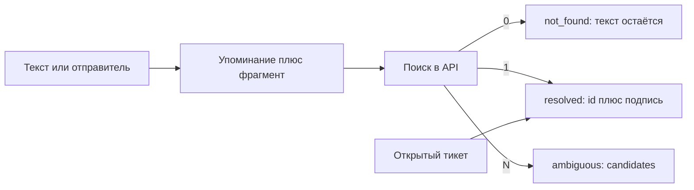

# Карточка обращения — документ `card`

**Заказчик:** ООО «СеверХолод»  
**Дата:** 25 августа 2026  
**Статус:** черновик схемы. Харнес — [harness.md](harness.md).

Это JSON-документ одного обращения Рефлекса. Его рисует левая колонка экрана. Агент не печатает его целиком в ответе: меняет кусками, код мержит, в базу каждый раз кладётся получившийся целый объект. Снимок того же JSON уходит в хронологию после каждого законченного прогона.

Заявка ITSM сюда не равна. Внутри `card` есть только проект полей заявки и результат примерки. След тулов и размышления живут в чате, не здесь.

---

## 1. Где что лежит

| Что | Где | Зачем так |
|-----|-----|-----------|
| Поля формы (канал, отправитель, получено, текст, вложение) | Колонки строки `appeals` и копия в `card.intake` | Журнал фильтрует по колонкам. Снимок самодостаточен: в хронологии виден вход, даже если строку потом не открывать |
| Документ карточки | `appeals.card` JSONB | Один объект на обращение, источник для UI |
| Статус для стола | Колонка `appeals.status`, выставляется из `card.decision` после прогона | Виджеты не разбирают JSON |
| Сообщения, мысли, вызовы тулов | Тред агента (чекпоинтер), лента чата | Пункт 5.6 брифа. В `card` не дублируем |
| Снимки и события «создано / прогон / реплика» | Таблица хронологии, у события опционально полный `card` | Отката в пилоте нет, след есть |
| Справочники СеверХолода | Их API, не наши таблицы | В `card` только id, подпись и кандидаты на слоте. Сырой ответ поиска — в чате |

Строка обращения рождается из формы. `card` в этот момент — пустой шаблон: `intake` заполнен, слоты фактов стоят с `binding.status = empty` или без привязки, решение пустое. Агент стартует с этим документом в стейте треда.

---

## 2. Два слоя у опознаваемого факта

Бриф просит на важном факте показать источник, фрагмент, уверенность и тип: факт, предположение, из системы. Если склеить это в одно поле «значение = ХУ-17, источник = текст», ломается как раз ваш пример: в письме оборудование назвали, в реестре не нашли. Одно значение не может быть одновременно «из текста» и «из системы не найдено».

Поэтому у клиента, объекта, оборудования и прежней заявки два слоя.

**Упоминание** — что сказали во входе или дописал диспетчер. Живёт всегда, даже когда поиск пустой.

**Привязка** — связали ли это с id в системе СеверХолода. Исходы привязки:

| `binding.status` | Что это значит | `id` | Упоминание |
|------------------|----------------|:----:|------------|
| `empty` | Никто не называл, поиск не из чего делать | нет | нет |
| `mentioned` | Назвали, поиск ещё не гоняли или ещё идёт | нет | есть |
| `resolved` | Ровно одна запись | да | может быть или нет (актив могли дотянуть из тикета, в письме кода не было) |
| `not_found` | Назвали, поиск отработал, совпадений ноль | нет | **оставляем** |
| `ambiguous` | Поиск вернул две и больше | нет | оставляем, в `candidates` — id и подписи |

Фрагмент исходного текста относится к упоминанию и к типу «факт». К привязке `resolved` фрагмент письма не клеим: там ссылка на запись (`C-101`, `S-MSK-01`, `A-1001`, `T-884`, `K-101`) и короткая подпись из ответа API (адрес, локальный код, тема тикета).

Проблема, симптомы, желаемый срок и резерв — не сущности справочника. У них нет привязки, только значение и свидетельства. «Вчера мастер говорил менять компрессор» тоже не id; отдельного реестра ремонтов у нас нет. Упоминание прошлой **заявки** — со слоем привязки к ITSM.



---

## 3. Свидетельство

Почти у каждого слота список `evidences`. Одно значение может держаться на нескольких опорах: «17-я» из письма (факт) и потом `A-1001` из реестра (система), или «17-я» из письма и пустой поиск (факт + привязка `not_found`).

| Поле | Смысл |
|------|--------|
| `kind` | `fact` — сказано во входе или диспетчером. `assumption` — модель вывела, в тексте этого нет. `system` — пришло ответом справочника или тикета |
| `source` | Откуда именно: `intake_text`, `intake_sender`, `intake_attachment`, `dispatcher`, `crm`, `eam`, `contract`, `itsm` |
| `fragment` | Прямая цитата. Нужна, когда `kind = fact`. Для `assumption` и `system` — `null` |
| `record` | Ссылка на запись системы: `system`, `id`, `label`. Нужна, когда `kind = system`. Для факта из письма — `null` |
| `confidence` | `high` / `medium` / `low` |

Правила, чтобы типы не поплыли:

- Сказали «ХУ-18» или «СеверФуд» — это `fact`, фрагмент обязателен. Даже кривое «17-я» — факт *того, что написали*, не факт что это именно инвентарный ХУ-17.
- Нормализация «17-я» → запрос `ХУ-17` — `assumption`, фрагмента нет. Какой запрос ушёл — видно в вызове тула в чате.
- Ответ реестра с `A-1001` — `system`, в `record` id и подпись, не цитата письма.
- Пустой поиск не создаёт свидетельство `system` с пустым id. Это статус привязки `not_found`.
- «Наверное Москва, потому что время московское» без слов о городе — `assumption`. Так объект не привязываем.
- Андрей из отправителя в слот клиента не кладём: контактов в CRM нет. Из строки «Андрей, СеверФуд» в клиенты уходит СеверФуд, фрагмент может быть всей строкой отправителя.

Уверенность: явная цитата «ХУ-18» — высокая на упоминании; догадка модели — средняя или низкая; однозначный ответ API по id — высокая на привязке. Два ХУ-17 без города — упоминание высокое, привязка `ambiguous`, не «выбрали более вероятный с высокой уверенностью».

---

## 4. Слоты фактов (бриф 5.1)

Восемь слотов, не свободный набор. Неизвлечённое не удаляем: слот есть, значение пустое.

### 4.1. С привязкой к id

`facts.customer`, `facts.site`, `facts.asset`, `facts.history` (только ветка «уже писал / тикет»).

```json
{
  "mention": "17-я",
  "binding": {
    "status": "not_found",
    "id": null,
    "label": null,
    "candidates": []
  },
  "evidences": [
    {
      "kind": "fact",
      "source": "intake_text",
      "fragment": "Снова 17-я: температура уже +8",
      "record": null,
      "confidence": "high"
    }
  ]
}
```

`candidates` — массив `{ "id", "label" }` и при необходимости `site_id`, чтобы кнопку «Дмитровское / Монтажников» собрать без второго похода в память. После того как диспетчер выбрал, статус становится `resolved`, выбранный id пишется в `binding.id`, список кандидатов можно оставить как «из чего выбирали».

`history.mention` держит и «я уже писал», и «вчера мастер говорил про компрессор». Привязка здесь только к заявке. Ремонт без тикета остаётся текстом: искать его негде. Искали открытые (и при необходимости явный id) — пусто → `not_found`, фразу не стираем. Нашли T-884 → `resolved`, в `record` тикет; актив с тикета можно дописать в `facts.asset` отдельным свидетельством `system` / `itsm`, даже если в этом письме кода не было.

Клиент и объект — разные слоты. «СеверФуд» без города: клиент может стать `resolved` (`C-101`), объект — `ambiguous` (две площадки). Это не одно поле.

### 4.2. Без привязки

`facts.problem`, `facts.symptoms`, `facts.desired_deadline`, `facts.backup`.

```json
{
  "value": "температура уже +8 и продолжает расти",
  "evidences": [
    {
      "kind": "fact",
      "source": "intake_text",
      "fragment": "температура уже +8 и продолжает расти",
      "record": null,
      "confidence": "high"
    }
  ]
}
```

У срока сырая фраза обязательна («сегодня до 19:00»). Разбор в дату-время, если делаем, пишет Python от `intake.received_at` и пояса площадки, когда пояс уже есть; это не догадка модели. Пока пояса нет — только фраза.

Резерв: свободный текст («резервная камера вроде работает»). Булев «есть / нет» не заводим: «вроде» иначе потеряется.

---

## 5. Что осталось от «обогащения»

Отдельного объекта `enrichment` с копиями последних `GET` нет. Пункт 5.2 брифа — это походы в справочники. Их результат на карточке уже разложен: 0, 1 или N записей становятся `not_found` / `resolved` / `ambiguous` и `candidates` на слоте. Запрос, сырой JSON и ошибка связи остаются в чате. Дублировать `items` ещё раз — второй источник правды, который разъедется с привязкой, едва поиск сузят.

Договор — единственное, чего в слотах 5.1 нет: в письме его обычно не называют, а расчёт SLA без него не показать. Это свой блок `contract`, не мешок «всё, что вернули системы».

| `contract.status` | Когда |
|-------------------|--------|
| `empty` | Площадка ещё не `resolved` — договор не спрашиваем |
| `resolved` | На площадку нашли один договор, поля из ответа на месте |
| `not_found` | Площадка есть, договора нет. Gold не выдумываем |

Поля при `resolved`: `id`, `site_id`, `plan`, `response_sla`, `service_window`, `coverage`. Агент переносит их из ответа `get_contract` через `update_card`. Поиск сам карточку не меняет.

Create/update по-прежнему не сюда: примерка в `decision.itsm_dry_run`.

---

## 6. Расчёт (бриф 5.4)

Пишет правило в инструменте `calculate`, не модель. Агент передаёт аргументы из ответов справочников и записывает результат через `update_card`. Желаемый срок можно положить в факты; числа приоритета, код SLA и дедлайн модель не назначает.

Один блок на текущий смысл прогона. Если исход ещё уточнение, но площадку уже сузили до одной — считаем от неё. Если площадок две — расчёт `blocked` или `conditional` («если это Дмитровское, то Gold, 60 минут»), без одного дедлайна «как будто уже выбрали».

Для создания и обновления аргументы могут разойтись: у обновления в аргументах уже есть приоритет живого тикета, «не понижаем». В блоке видно, для какой ветки посчитали (`branch`: `create` / `update` / `none`).

```json
{
  "branch": "update",
  "status": "computed",
  "priority": {
    "value": "high",
    "formula": "критичность актива и симптомы температуры; при обновлении не ниже, чем на тикете",
    "arguments": {
      "asset_criticality": "high",
      "ticket_priority": "high",
      "symptoms": "8,3"
    },
    "missing": []
  },
  "sla": {
    "code": "60_minutes",
    "formula": "код договора выбранной площадки",
    "arguments": { "contract_id": "K-101", "plan": "Gold" },
    "missing": []
  },
  "deadline": {
    "at": "2026-08-13T17:40:00+03:00",
    "timezone": "Europe/Moscow",
    "formula": "получено + 60 минут, окно 24x7",
    "arguments": {
      "received_at": "2026-08-13T16:40:00+03:00",
      "response_sla": "60_minutes",
      "service_window": "24x7"
    },
    "missing": []
  }
}
```

`missing` — чего не хватает, чтобы досчитать или чтобы цифра не поехала. Желаемый срок клиента, который ужеше договора, в дедлайн молча не подставляем: дедлайн остаётся расчётным, расхождение уходит в предупреждения решения.

Формулы словами здесь, арифметика — в регламенте, когда до него дойдём. В схеме важно: есть результат, формула, аргументы, пробелы.

---

## 7. Решение (бриф 5.3) и пакет 5.5

### Уточнение — это исход, не дырка

Прогон агента заканчивается одним главным `outcome`. «Запросить уточнение» входит в этот список наравне с create и update. Агент не «ещё не решил»: он решил, что писать в ITSM нельзя, и назвал, чего не хватает.

Не закончено в другом смысле: **обращение** ещё живое, диспетчер может дописать факт, пойдёт новый прогон, исход сменится. Для стола это «нужно уточнение». Для карточки решение уже есть.

Пока прогон идёт, `decision.outcome` либо пустой (первый раз), либо старый (ждём новый). Отдельный `run_status` на строке обращения: `running` / `waiting` / `idle`. Это не исход и не вердикт прода.

| `outcome` | Смысл | Статус обращения | `auto_in_prod` |
|-----------|--------|------------------|----------------|
| `create` | Объект однозначен, открытого тикета про то же нет, политика пускает | разобрано | true, если примерка принята |
| `update` | Открытый тикет про то же, сразу обновление | разобрано | true, если примерка принята |
| `clarify` | Нельзя безопасно выбрать клиента или объект; заявку не заводили | нужно уточнение | false |
| `dispatch` | Автоматика не знает, что делать: ошибка системы, конфликт, который правилом не закрыт | диспетчеру | false |
| `approve` | Опознано, но договор или срок требуют человека сверху | на согласовании | false |
| `refuse_auto` | Опознано, write запрещён и даже на согласование как «можно, но с оговоркой» не тянет (например, договора уже нет). Причина обязательна | диспетчеру | false |

`clarify` — когда опоры нет (два ХУ-17, клиент не найден, актив назвали и не нашли). `approve` / `refuse_auto` — когда опора есть, а политика не пускает обещанное. Путать их нельзя: «не нашли ХУ-99» это уточнение или диспетчеру, не отказ «срок договора истёк».

Вопросы живут в `decision.questions` и тем же смыслом уходят в markdown чата. Канон для UI и для следующего прогона — список в карточке. Пустой массив не показываем рамкой.

Предупреждения — `decision.warnings`: и в карточке, и в чате, и отдельной рамкой в UI. Код плюс фраза (`coverage`, `deadline_vs_wish`, `backup_uncertain`, `ambiguous_asset`, `closed_ticket`).

Проект ответа клиенту — `decision.reply_draft`. В канал не отправляется. На `clarify` это может быть текст вопросов, который диспетчер унесёт в почту руками.

Проект заявки — `decision.ticket_draft`: поля ITSM (`customer_id`, `site_id`, `asset_id` или нет, `contract_id`, `summary`, `priority`). Собирает код из привязок и расчёта, не свободный вымысел модели. Нет однозначных клиента и объекта — `null`, не полупустой черновик.

Примерка — `decision.itsm_dry_run`. Только после `create` / `update`. Иначе `null`.

Вердикт «в проде ушло бы автоматом» — `decision.auto_in_prod`. Это про законченный прогон, не про то, что обращение закрыто навсегда. На `clarify` он false: автоматика остановилась. После реплики диспетчера прогон новый, вердикт может стать true.

Предлагаемое действие брифа 5.5 — это `outcome` плюс draft. Вызванные инструменты в карточку не кладём.

```json
{
  "outcome": "clarify",
  "reason": "Код ХУ-17 найден на двух площадках, город в тексте не назван. Заявку не заводим.",
  "grounds": ["facts.asset.binding.ambiguous"],
  "ticket_draft": null,
  "itsm_dry_run": null,
  "auto_in_prod": false,
  "questions": [
    {
      "id": "which_site",
      "text": "Это Дмитровское шоссе, 100 в Москве или улица Монтажников, 7 в Екатеринбурге?",
      "blocks": ["site", "asset"]
    }
  ],
  "warnings": [
    {
      "code": "ambiguous_asset",
      "text": "Два актива с локальным кодом ХУ-17, без выбора площадки привязки нет."
    }
  ],
  "reply_draft": "Нужно уточнить объект: Москва, Дмитровское, или Екатеринбург, Монтажников."
}
```

`grounds` — какие слоты и ответы систем подержал исход, чтобы «на основании чего» не было только прозой.

---

## 8. Целиком: шаблон `card`

Поля, которые код создаёт в момент приёма. Агент пишет факты, привязки, договор, расчёт и черновик решения через `update_card`. Код после прогона только страхует исход и делает примерку заявки. `schema_version` нужен, чтобы не гадать над старыми снимками.

```json
{
  "schema_version": 1,
  "intake": {
    "channel": "email",
    "sender": "Андрей, СеверФуд",
    "received_at": "2026-08-13T16:40:00+03:00",
    "text": "Снова 17-я: температура уже +8 и продолжает расти. …",
    "attachment_text": null
  },
  "facts": {
    "customer": { "mention": null, "binding": { "status": "empty", "id": null, "label": null, "candidates": [] }, "evidences": [] },
    "site": { "mention": null, "binding": { "status": "empty", "id": null, "label": null, "candidates": [] }, "evidences": [] },
    "asset": { "mention": null, "binding": { "status": "empty", "id": null, "label": null, "candidates": [] }, "evidences": [] },
    "problem": { "value": null, "evidences": [] },
    "symptoms": { "value": null, "evidences": [] },
    "desired_deadline": { "value": null, "parsed_at": null, "evidences": [] },
    "backup": { "value": null, "evidences": [] },
    "history": { "mention": null, "binding": { "status": "empty", "id": null, "label": null, "candidates": [] }, "evidences": [] }
  },
  "contract": {
    "status": "empty",
    "id": null,
    "site_id": null,
    "plan": null,
    "response_sla": null,
    "service_window": null,
    "coverage": []
  },
  "calculation": {
    "branch": "none",
    "status": "blocked",
    "priority": { "value": null, "formula": null, "arguments": {}, "missing": [] },
    "sla": { "code": null, "formula": null, "arguments": {}, "missing": [] },
    "deadline": { "at": null, "timezone": null, "formula": null, "arguments": {}, "missing": [] }
  },
  "decision": {
    "outcome": null,
    "reason": null,
    "grounds": [],
    "ticket_draft": null,
    "itsm_dry_run": null,
    "auto_in_prod": null,
    "questions": [],
    "warnings": [],
    "reply_draft": null
  }
}
```

---

## 9. Кто имеет право писать какой кусок

Это уже задел на harness, не список тулов.

| Кусок | Кто пишет | Как |
|-------|-----------|-----|
| `intake` | Приём обращения | Один раз, дальше только чтение |
| Упоминания и `kind=fact` / `assumption` | Агент через патч | Pydantic патча, мерж слота |
| Привязка и `kind=system` | Код после тула поиска | По 0 / 1 / N. Агент не ставит `resolved` руками, если items не ровно один |
| `contract` | Код после тула договора | Только если площадка уже `resolved` |
| `calculation` | Правило | После того как привязки и договор стабилизировались в этом прогоне |
| `ticket_draft` | После прогона, если create/update и опора ясна | Сборка из id и расчёта |
| `itsm_dry_run` | Там же, примерка ITSM | Не отдельный тул модели |
| `outcome`, `reason`, `questions`, `warnings`, `reply_draft` | Финал ответа модели | Если назвали create/update без опоры — заявку не пишем, исход на карточке правим на уточнение |
| `auto_in_prod` | После прогона | true только если примерка реально ушла и принята |

Обязательность полей схемы слабая: в середине прогона дырки законны. Заявку не собираем, пока клиент и объект не `resolved`.

---

## 10. Как это закрывает пункт 5 брифа

| Пункт | В `card` | Не в `card` |
|-------|----------|-------------|
| 5.1 факты, источник, фрагмент, уверенность, тип | Слоты и `evidences` | — |
| 5.2 чтение систем | Привязки на слотах и блок `contract` | Запросы и сырые ответы — в чате |
| 5.2 dry-run write | `decision.itsm_dry_run` | — |
| 5.3 решение и основание | `outcome`, `reason`, `grounds` | — |
| 5.4 приоритет, SLA, дедлайн | `calculation` | Формулы-арифметика в регламенте |
| 5.5 карточка заявки | `ticket_draft` | — |
| 5.5 действие | `outcome` | — |
| 5.5 инструменты | — | Чат / 5.6 |
| 5.5 проект ответа, вопросы, предупреждения | `reply_draft`, `questions`, `warnings` | Повтор в чате и рамки UI |
| 5.5 auto / человек | `auto_in_prod` | Статус стола — колонка обращения |
| 5.6 след | — | Сообщения треда и хронология снимков |

---

## 11. Три разбора на одной схеме

**Назвали, не нашли.** Упоминание «КМ-9», поиск пустой. `asset.binding.status = not_found`, фрагмент на месте, кандидаты пустые. Исход скорее `clarify` или `dispatch`, не create «на площадку без актива».

**Назвали, два мира.** «17-я», два актива. Упоминание живо, `ambiguous`, кандидаты A-1001 и A-1002. Клиент уже может быть `resolved`. Расчёт условный или заблокирован. Исход `clarify`, вопрос про площадку в `questions` и в чате.

**Упомянули прошлое, нашли тикет.** «Писал сорок минут назад про семнадцатую». `history` → T-884. С тикета в актив уходит A-1001 как `system`. Если в письме ещё и «17-я», у актива два свидетельства: факт из текста и система из тикета. Исход `update`, не create-потом-отмена.

---

Дальше после «ок» на карточку и harness — регламент формул и покрытие договора. Числа в этой схеме уже куда класть.
