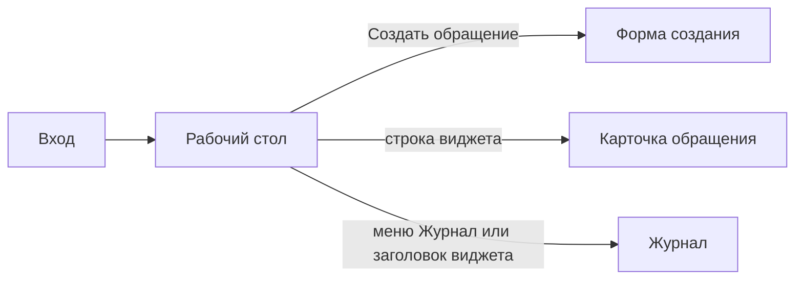
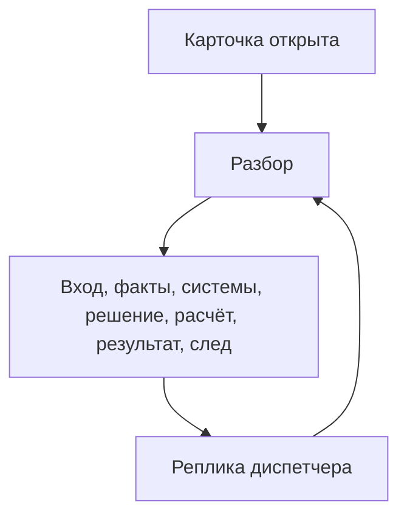

# Функциональная спецификация Рефлекса

**Заказчик:** ООО «СеверХолод»  
**Дата:** 24 августа 2026  
**Статус:** черновик. Есть вход, стол, журнал, форма создания и карточка обращения. Регламент разбора ещё не открыт.

Это не макет и не выбор цветов. Здесь — какие экраны есть, что на них видно, какие кнопки что делают. Пиксели не фиксируем. API СеверХолода — в [api.md](api.md). Правила разбора появятся в регламенте, когда экран до них дойдёт.

---

## 1. Вход

Рефлекс открывается в браузере. Первая страница — вход диспетчера. Одна роль, отдельной модели прав нет: кто вошёл, тот видит все обращения пилота.

На форме два поля: логин и пароль. Оба обязательны. Пустой ввод не отправляется, под полем — «заполните логин и пароль». Неверная пара — сообщение на этой же странице, без смены URL. Успех — переход на рабочий стол.

Полноценную корпоративную авторизацию (SSO, роли, LDAP) не делаем. В пилоте достаточно заранее заведённого диспетчера в конфиге Рефлекса, чтобы стол был «чьим-то» и в журнале было видно, кто создал обращение.

Выход — ссылка в шапке на любом внутреннем экране. После выхода снова форма входа, назад по истории браузера на стол не пускает.

Имени клиента СеверФуд, объектов и заявок на экране входа нет.

---

## 2. Рабочий стол

После входа диспетчер попадает на стол. Это очередь **обращений Рефлекса**, не ящик почты СеверХолода. Писем из их каналов здесь нет и быть не может: вход в пилоте — кнопка «Создать обращение» или наш API.

В шапке: название модуля, кто вошёл, выход. В меню слева или сверху два пункта: «Стол» (текущий экран) и «Журнал». Других разделов в этом куске не заводим.

На столе четыре виджета по статусу обращения. Счётчик — сколько дел сейчас в статусе. Список внутри виджета — несколько последних строк: время получения, канал, отправитель, обрезка текста. Клик по строке открывает карточку этого обращения. Клик по заголовку виджета открывает журнал с тем же фильтром статуса.

Четыре статуса на столе — те, о которых уже договорились, не новые:

| Виджет | Какие обращения |
|--------|-----------------|
| Новые | Только что приняты, разбор ещё идёт или только закончился и исход ещё не разложили по другим корзинам |
| Нужно уточнение | Объект или клиент неоднозначны, заявку не заводили |
| Диспетчеру | Автоматика остановилась, решать человеку |
| На согласовании | Формально всё опознано, но действие упирается в договор или срок |

Отдельного виджета «готово / заявка ушла в dry-run» на столе нет: такие дела смотрят в журнале со статусом «разобрано».

Пустой виджет показывает короткое «нет обращений», не таблицу-заглушку.

На столе одна главная кнопка: **«Создать обращение»**. Она открывает форму нового входа. Других кнопок действия на столе нет: нет «забрать inbox», нет опроса каналов, нет «агент не прав».

Пока агент разбирает только что созданное дело, строка может висеть в «Новых» с пометкой «идёт разбор». Обновление счётчиков — после завершения разбора или по обновлению страницы. Живой стрим шагов на столе не рисуем: ход агента будет на карточке обращения.

---

## 3. Журнал обращений

Пункт меню «Журнал» открывает полный список обращений Рефлекса, не писем СеверХолода. Сюда же ведёт заголовок виджета на столе: тогда список уже сужен по статусу этого виджета.

В таблице строки: время получения, канал, отправитель, обрезка текста, статус, кто создал (логин диспетчера или «API»). Отправитель — то, что пришло во входе («Андрей, СеверФуд»), не карточка из CRM. Опознанного клиента из справочника отдельной колонкой не рисуем; фильтр «клиент» в пилоте не заводим.

Фильтры над таблицей только те, что есть у самого обращения с момента создания:

| Фильтр | Значения |
|--------|----------|
| Статус | все / новые / нужно уточнение / диспетчеру / на согласовании / разобрано |
| Канал | все / email / Telegram / звонок / личный кабинет |
| Период | по дате получения: с / по |

«Разобрано» — дела, которые уже не висят в четырёх виджетах стола: разбор закончен, заявка в ITSM ушла на проверку или исход закрыт без write. Отдельного виджета под них на столе нет, в журнале они видны.

Сброс фильтров возвращает полный список. Пустой результат — «нет обращений по фильтру», не ошибка.

Клик по строке открывает ту же карточку обращения, что и клик со стола. Отдельного просмотра «только строка» нет. Сортировка по умолчанию — новые сверху (по времени получения). Выгрузки, массовых действий и страниц настроек колонок нет.

---

## 4. Создание обращения

Кнопка «Создать обращение» со стола открывает форму. Это тот же вход, которым e2e бьёт в API Рефлекса. В примере брифа у сообщения четыре заголовка плюс текст: канал, отправитель, получено, тело. В «минимальном входе» отправитель не перечислен, но в примере он стоит отдельной строкой — на обращении это поле, не кусок текста.

| Поле | Обязательно | Как выглядит |
|------|:-----------:|--------------|
| Канал | да | Список: email, Telegram, звонок, личный кабинет |
| Отправитель | нет | Одна строка, как в примере: «Андрей, СеверФуд». Не выбор из CRM, не email и не телефон — в брифе их нет |
| Дата и время получения | да | Дата-время. По умолчанию — сейчас в браузере; диспетчер может поставить «13 августа 2026, 16:40», как в примере брифа |
| Текст | да | Многострочное поле свободного текста |
| Текст вложения | нет | Ещё одно многострочное поле. Не загрузка файла |

Отправитель живёт на обращении и потом на карточке во входных данных. Это не контактная карточка СеверХолода: в их API контактов нет, по «Андрей» справочник не ищем.

Проверки до отправки: канал выбран из списка, текст не пустой, дата заполнена. Отправитель может быть пустым. Иначе под полем — что не так, запрос не уходит. Двойной клик «Создать» второй раз не шлёт.

Две кнопки: **Создать** и **Отмена**. Отмена возвращает на стол, черновик не храним. Создать заводит **новое** обращение (склейки с прошлыми нет) и сразу открывает его карточку. Пока агент работает, карточка уже открыта, стол в виджете «Новые» может показать «идёт разбор».

Ошибки сервера (Рефлекс не принял, нет связи) — сообщение на форме, обращение не создано, текст не пропадает.

---

## 5. Карточка обращения

Карточка открывается из виджета стола, из журнала или сразу после «Создать». Это одно обращение Рефлекса, не заявка ITSM и не письмо из ящика СеверХолода. Заявка, если до неё дошли, видна здесь как проект полей и результат проверки мока.

В шапке карточки: идентификатор обращения, статус обращения, кто создал (логин или «API»), вердикт «в проде ушло бы автоматом / в проде нужен человек». Назад — на стол или в журнал, откуда пришли. Кнопки «агент не прав» нет. Исходящей отправки клиенту нет.

Пока агент ещё разбирает только что созданное дело, карточка уже открыта. В шапке статус «новые» и пометка «идёт разбор». Блоки ниже либо пустые с той же пометкой, либо наполняются по мере шагов. Живой стрим на стол не уходит: ход виден здесь.

После разбора шапка и блоки ниже показывают последний прогон. Если диспетчер дописал факт в диалог, разбор идёт заново на том же обращении: вход не меняется, факты, системы, решение, расчёт и след пересчитываются.

### Входные данные

Блок только для чтения. Это то, с чем обращение родилось, не результат разбора. Поля те же, что на форме создания: канал, отправитель, дата и время получения, текст, текст вложения. Отправитель пустой — на карточке «не указан». Вложения нет — «вложения нет», пустую простыню не рисуем.

Редактировать исходный текст и заголовки с карточки нельзя. Если клиент прислал новое письмо, это будет другое обращение. Если диспетчер узнал недостающее вне модуля, он пишет это в диалог, а не правит вход.

### 5.1 Факты

Таблица извлечённого. Строки — типы фактов из брифа, не свободный набор «что модель ещё придумала»:

| Факт | О чём строка |
|------|----------------|
| Клиент | Имя или id заказчика, которого назвали в тексте или в отправителе |
| Объект | Площадка: адрес, город, id |
| Оборудование | Локальный код, тип, id актива |
| Проблема | Что случилось, своими словами |
| Симптомы | Наблюдаемое: температура, «не запускается» |
| Желаемый срок | «сегодня до 19:00», «нужен человек» |
| Резерв | Есть ли запасная камера, выдержит ли |
| Прошлое | Отсылка к вчерашнему мастеру, к уже написанному, к открытой заявке |

Для каждой строки на карточке видно одно и то же: значение (или пусто), откуда взяли, фрагмент исходного текста, уверенность (высокая / средняя / низкая), тип значения — факт из текста, предположение модели или результат поиска в системах СеверХолода.

Пустую строку не выкидываем: «не извлечено» честнее, чем отсутствующее поле. Недостающее не дорисовываем из «скорее всего Москва».

Клиент в этой таблице — не отправитель из заголовка. «Андрей, СеверФуд» во входе может стать подсказкой для факта «клиент = СеверФуд»; сам Андрей контактом CRM не становится.

### 5.2 Ответы систем

Только чтение справочников. Сюда не кладём создание и обновление заявки: это не обогащение, а примерка после решения, она в блоке 5.3 / 5.5.

Четыре группы, по вызовам из [api.md](api.md):

| Система | Что показать |
|---------|----------------|
| Клиенты и объекты | Список площадок, который вернул поиск, или «ничего не нашли». Две площадки СеверФуда — обе строки, без «наиболее вероятной» |
| Оборудование | Активы. Два ХУ-17 без города — оба |
| Договор | План, коды SLA и окна, покрытие. Нет площадки — блока договора нет, не угадываем Gold |
| Открытые заявки | То, что нашли по клиенту, площадке или активу. В сиде это может быть T-884. Закрытую автоматом сюда как «ту же заявку» не подсовываем |

У каждого вызова видно запрос (какие фильтры ушли) и ответ. Пустой список — валидный ответ, не ошибка. Ошибка связи или 4xx/5xx — отдельная строка «вызов не удался», с кодом если есть. Тогда write не делаем, исход карточки — «диспетчеру».

### 5.3 Решение

Один главный исход, не шесть равноправных кнопок. На карточке он назван и объяснён: на основании каких фактов, каких ответов систем и какого правила регламента так решили. Сами правила — в регламенте; здесь — что человек видит.

| Исход | Что это на карточке | Статус обращения после разбора |
|-------|---------------------|--------------------------------|
| Создать заявку | Объект однозначен, открытого тикета про тот же инцидент нет, политика пускает write | разобрано |
| Обновить заявку | Нашли открытый тикет про тот же инцидент — сразу обновление, без «сначала хотели создать» | разобрано |
| Нужно уточнение | Клиента или объект нельзя выбрать безопасно. Заявку не заводили | нужно уточнение |
| Диспетчеру | Автоматика остановилась: ошибка системы, средняя уверенность, странный конфликт, который правилом не закрыт | диспетчеру |
| На согласовании | Формально всё опознано, но договор или срок запрещают обещанное | на согласовании |
| Отказ автоматического действия | Тот же случай, что согласование или останов: write не уходит, причина написана словами. Это не кнопка оценки агента | на согласовании или диспетчеру — куда сел главный исход |

«Отклонить автоматическое действие» на экране не кнопка. Это формулировка причины рядом с исходом: почему create или update не делаем, хотя опознание уже полное (ремонт по Basic, «сегодня» при SLA следующего рабочего дня). Неполная опознанность — это уточнение, не этот отказ.

Если справочники ответили, а площадок две и город не назван — исход «нужно уточнение», а не «отклонить». Если площадка ясна, а актив нет — заявку «на площадку на всякий случай» не заводим, снова уточнение. Это уже ДАНО, не развилка экрана.

### 5.4 Приоритет, SLA, дедлайн

Три числа (или кода) и разбор, как они получились. Не одна строка «приоритет high».

На карточке у каждого из трёх одно и то же устройство:

- результат (приоритет `low` / `medium` / `high` / `critical`; код SLA с договора; дата-время дедлайна в часовом поясе площадки);
- формула из регламента, человекочитаемо, не «магия модели»;
- подставленные аргументы: план договора, окно, критичность актива, время получения, желаемый срок из текста;
- чего не хватает, чтобы досчитать или чтобы результат не поехал.

Площадки нет — SLA и дедлайна нет, вместо них текст, что считать не от чего. Площадка есть, актив нет — можно показать SLA договора площадки и явно сказать, что критичность актива не участвовала. Желаемый срок клиента, который договор не обещает, не переписывает дедлайн молча: дедлайн остаётся расчётным, расхождение уходит в предупреждения.

Считать эти поля должна не LLM. На карточке в следе шаг помечен как правило. Формулы появятся в регламенте; экран уже требует, чтобы они были видны целиком, а не только итог.

### 5.5 Результат для бизнеса

Собранный пакет после решения, то, что бриф зовёт «карточкой заявки» и «результатом».

**Проект заявки.** Поля, которые ушли бы в ITSM: клиент, площадка, актив если однозначен, договор, текст, приоритет. Рядом — то, что в мок не отправляем, но диспетчеру нужно: код SLA, окно, расчётный дедлайн. Проект собираем только если клиент и объект однозначны. Иначе здесь честно «собрать заявку некуда», не полупустой черновик на угаданную площадку.

**Примерка в ITSM.** Только при исходе «создать» или «обновить». На карточке: `accepted`, `persisted` (в пилоте обычно ложь), какой бы id дали (`would_ticket_id` или живой `ticket_id`), какой бы статус поставили, список проверок ФЛК. Провал ФЛК не притворяется успехом: `accepted: false` и какие проверки не прошли. При уточнении, диспетчере, согласовании и отказе этот вызов не делается.

**Вердикт auto / HITL.** То, что было бы в проде: write ушёл бы сам или автоматика остановилась бы. В пилоте запись всё равно только если в моке включены мутации. Вердикт не кнопка подтверждения каждого письма.

**Проект ответа клиенту.** Текст на карточке. Сами в канал не отправляем, кнопки «отправить» нет.

**Вопросы на уточнение.** Конкретные, на которые диспетчер может спросить клиента вне модуля или ответить сам. Пустой список не рисуем.

**Предупреждения.** Договор не покрывает обещанное, желаемый срок ужеше SLA, резерв «вроде работает», два актива с одним кодом, закрытая старая заявка на тот же актив. Каждое — фраза, не код. Пустой список не рисуем.

Вызванные инструменты в этом блоке не дублируем списком: они в следе.

### 5.6 След разбора

Хронология последнего прогона, понятная и интервьюеру, и диспетчеру. На каждый шаг: что делали, инструмент или правило, что получили, это была LLM или нет, как шаг сдвинул решение.

Типичный порядок, не жёсткий сценарий на все письма: приём входа → извлечение фактов (LLM) → поиск площадок → поиск активов → договор → открытые заявки → правило исхода → расчёт приоритета и дедлайна (правило) → при create/update вызов ITSM → сбор проекта ответа (LLM). Шаг, которого не было, в следе не рисуем пустым.

Итог следа — коротко, почему главный исход такой, со ссылкой на правило, а не «модель так сказала».

Старые прогоны после реплики диспетчера отдельной лентой не храним на экране: виден последний след. Что именно дописали — видно в диалоге.

### Диалог диспетчера

Внизу карточки — переписка с агентом по этому обращению. Новый вход это не создаёт. Склейки с другим обращением нет.

Диспетчер пишет свободный текст: недостающий город, «это Дмитровское, ХУ-17», «клиент подтвердил ремонт, согласовали», «повтори разбор». Отправка запускает новый разбор на том же id. Входные данные те же плюс реплики диалога как дополнительные факты от человека. После пересчёта статус на столе может смениться: из «нужно уточнение» уйти в «разобрано» или на согласование.

Реплики остаются по порядку, с автором (логин или «агент») и временем. Агент в диалоге может коротко сказать, что изменилось; полный разбор — в блоках выше, не второй копией в чате.

Отдельных кнопок «разрешить write», «завести заявку вручную» и «агент ошибся» нет. Если на согласовании человек дал исключение, он пишет это в диалог, и правило уже видит новый факт. Если данных по-прежнему мало — статус не прыгает сам.

Клиенту из этого диалога ничего не уходит.

---

Дальше после «ок» — регламент разбора: лестница исходов, когда какой вызов, формулы приоритета, SLA и дедлайна, что пересчитывать после реплики диспетчера.
