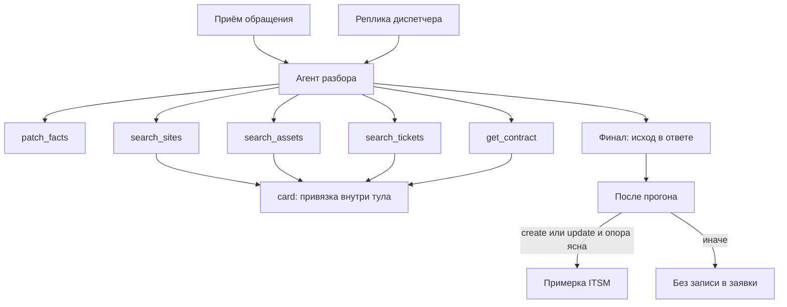

# Agent Harness — Рефлекс, разбор обращения

**Заказчик:** ООО «СеверХолод»  
**Дата:** 25 августа 2026  
**Статус:** черновик контракта. Карточка — [card.md](card.md), методы объекта — [api.md](api.md). System prompt и формулировки тулов на разработке (sprint 04) пересобираем skill'ом `agent-harness-construction`, не переносим текст «как есть».

Связанные файлы методологии (`vision.md`, `generation.md`) в этом проходе не открываем: контракт агента живёт здесь, в пакете пилота.

| Поле | Значение |
|------|----------|
| Профиль | частично `agent-platform-v1` |
| Что отклонили | RAG и эмбеддинги нет. Субагентов нет. Продуктовый MCP нет. Виртуальная ФС и планировщик Deep Agents не берём. Полный `card` не отдаём через `response_format`. Промпты — файлы в git, не Langfuse Prompt Management |

Один агент наполняет `card` и останавливается с исходом. Левая колонка рисует документ. Чат показывает ход: мысли, тулы, markdown диспетчеру.

---

## 1. Назначение и границы

Harness крутит разбор **одного** обращения. На входе — строка `appeals` и пустой шаблон `card`. На выходе законченного прогона — тот же `card` с фактами, привязками, договором если можно, расчётом если можно, одним `decision.outcome`, плюс реплика в чат.

**Делает:** извлекает упоминания; ищет площадки, активы, договор, открытые заявки; в теле этих же тулов проставляет привязку 0 / 1 / N; считает SLA после договора; в конце модель сама называет исход; примерка ITSM — только если create/update и опора однозначна.

**Не делает:** не пишет клиенту в канал; не назначает группу; не склеивает письма; не оживляет закрытый тикет; не заводит заявку при неясном объекте; нет тула-двери `commit_decision`.

---

## 2. Топология

Один main. Субагентов нет: иначе появится второй `card` и спор, чей снимок рисовать.



| Узел | Роль | Свой фреймворк? | Свои промпты? |
|------|------|:---------------:|:-------------:|
| Агент разбора | Единственный LLM-цикл обращения | нет | да, один system + правила слотов |

«Код ставит id» — это не третий актёр. Агент вызывает `search_assets`, функция тула ходит в мок, смотрит сколько строк и **в этом же вызове** пишет `binding` на карточку, затем возвращает модели `summary` и `items`. Модель id не назначает и отдельный «resolve» не зовёт.

Кнопка «Дмитровское» в первой версии — обычная реплика в чат с id или адресом, новый прогон. Отдельного `choose_candidate` нет.

---

## 3. Платформа и пакеты

Пилот — один продукт, отдельной «платформы на много harness» нет.

| Слой | Что лежит |
|------|-----------|
| Рантайм | LangChain `create_agent`, чекпоинтер, стрим в UI |
| Этот harness | system prompt, описания тулов, расчёт, сборка draft, предохранитель после прогона |

`create_deep_agent` не берём. Каркас — LangChain `create_agent`, `card` в стейте, пять тулов. `TodoListMiddleware` пока нет.

Путь в репозитории появится вместе с каркасом сервиса. Харнес Рефлекса не импортирует чужие продуктовые агенты — их нет.

---

## 4. Реестр конфигураций

Один конфиг, в коде: `reflex-appeal`. UI его не выбирает. Добавление второго агента — отдельное решение, не строка в CMS.

---

## 5. Контракт рантайма

| Операция | Есть? | Что возвращает |
|----------|:-----:|----------------|
| `invoke` | да | Для e2e и API «принять обращение»: финальный `card`, последнее сообщение, usage |
| `stream` | да | Основной UI: мысль, вызов тула, ответ тула, патч карточки, токены markdown, конец прогона |
| `cancel` | нет в пилоте | Прогон короткий; стоп не обещаем |
| `context_usage` | да, если провайдер отдаёт | Считаем на бэкенде, не в браузере |

Старт прогона невозможен без `appeal_id`. В стейт кладём текущий `card` (после создания — шаблон с `intake`). `thread_id` чекпоинтера равен `appeal_id`. Новая реплика диспетчера — новый `stream` на том же треде, `card` уже в чекпоинтера.

Первое user-сообщение — не сырой JSON, а собранный вход: канал, отправитель, время, текст, вложение. Плюс в системный контекст хода — актуальный `card`, чтобы модель видела пустые слоты и не заново выдумывала структуру.

---

## 6. Путь к LLM

| Вопрос | Решение |
|--------|---------|
| SDK | LangChain, чат-модель через `init_chat_model` |
| Gateway | Прямой OpenAI-совместимый endpoint (как в шапке проекта). LiteLLM не обязателен |
| Где крутится модель | Внешний API |
| Каталог в UI | Нет выбора модели у диспетчера |
| Structured output | Не на весь `card`. В конце прогона — короткий финал: исход, причина, вопросы, предупреждения, черновик ответа |
| Эмбеддинги | Нет |
| Секрет | Переменные окружения (`.env` локально, в git не коммитим; в репо — `.env.example` с пустыми плейсхолдерами). Нет ключа — процесс не стартует |
| Смена провайдера | Имя модели и base URL в настройках; тулы не меняются |
| Рассуждения в UI | Если провайдер отдал thinking / reasoning — показываем в чате всегда, блоком. Нет блока — ничего не выдумываем |

На исход карточки рассуждения не влияют. Примерку заявки включает не модель, а проверка после прогона.

---

## 7. Промпт-менеджмент

Канон промптов — файлы в git, ревью в PR. Langfuse смотрит трассы, датасеты и оценки, тексты промптов оттуда не правим. Язык system — русский, как и ответы диспетчеру.

---

## 8. Инструкции агенту

Канон: [prompts/system.md](prompts/system.md). В нём роль, недоверенный ввод, тулы, исходы. Выжимка слотов — [card.md](card.md), в system не дублируем формулы SLA.

В первый ход отдельно: `appeal_id`, текущий `card`, вход в user-сообщении.

---

## 9. Каталог инструментов

Пять тулов. В брифе были `find_customer_or_site`, `find_assets`, `get_contract`, `find_open_tickets`, `create_or_update_ticket`. Создание заявки модель не вызывает: примерку делает код после финала, если исход create/update и опора ясна.

Каждый ответ тула одной формы:

```json
{
  "status": "success",
  "summary": "Одна строка для чата и для модели",
  "next_actions": ["что разумно сделать дальше"],
  "artifacts": { "updated": ["facts.site"] },
  "result": {}
}
```

`status`: `success` — вызов прошёл, даже если список пустой (`warning`, если искали по упоминанию и не нашли). `error` — сеть или 4xx/5xx. После двух ошибок одного справочника модели лучше поставить исход `dispatch`, а не крутить третий раз.

### 9.0. Общая таблица

| Tool | Кто вызывает | Аргументы | Зачем | Типичная ошибка |
|------|--------------|-----------|-------|-----------------|
| `patch_facts` | агент | [PatchFactsInput](schemas/patch_facts.py) | Записать упоминания и смыслы, не трогая binding | Пустой вызов; `binding` в аргументах; fact без цитаты |
| `search_sites` | агент | как `GET /crm/v1/sites` | Найти клиента и площадки, код проставит привязку | Нет ни одного фильтра; `q=Андрей` пусто — так и надо |
| `search_assets` | агент | как `GET /eam/v1/assets` | Найти оборудование | Без фильтра; два ХУ-17 — не выбирать |
| `search_tickets` | агент | как `GET /itsm/v1/tickets`, либо пусто = id с уже resolved слотов | Найти открытые заявки | Нечего подставить — ещё нет клиента/площадки/актива |
| `get_contract` | агент | `site_id` необязателен: по умолчанию resolved площадка | Заполнить `card.contract` | Площадка не resolved — отказ, не гадаем Gold |

Отдельного тула решения и отдельного `create_ticket` нет.

### 9.1. MCP

Продуктовые tools — in-process обёртки над HTTP мока. MCP-сервер заведём, если появится второй потребитель. Сейчас не нужен.

### 9.2. `patch_facts`

Схема аргументов: [schemas/patch_facts.py](schemas/patch_facts.py). `extra=forbid`: поле `binding` не пройдёт валидацию. Опущенный слот не меняет карточку. `fact` — цитата и источник из входа или диспетчера. `system` — `record` с id из ответа поиска, без фрагмента письма. Срок — только сырая фраза.

Мерж: новые evidences добавляются, mention/value заменяются, если пришли. Нормализация «17-я» → ХУ-17 живёт в аргументе поиска, не вместо mention.

### 9.3. Поиски и правило 0 / 1 / N

Тул ходит в мок и **сам** меняет привязки по числу `items`. В чат уходит запрос, список и новый статус слота. Модель не вызывает «resolve».

**`search_sites`**

| Сколько `items` | Что пишет код |
|-----------------|----------------|
| 0 | Если было упоминание клиента — `customer.binding = not_found`. То же для объекта, если его упоминали. Id не ставим |
| 1 | Клиент `resolved` (`customer_id`, подпись — имя). Объект `resolved` (`site_id`, подпись — адрес). Свидетельства `system` / `crm` |
| несколько, один `customer_id` | Клиент `resolved`. Объект `ambiguous`, в `candidates` все площадки |
| несколько разных клиентов | Оба слота `ambiguous` |

**`search_assets`**

| Сколько `items` | Что пишет код |
|-----------------|----------------|
| 0 | Если актив упоминали — `not_found`, mention жив |
| 1 | Актив `resolved`. Если объект ещё не `resolved`, ставим площадку актива: один актив однозначно даёт объект |
| несколько, одна `site_id` | Актив `ambiguous`. Объект можно `resolved` на эту площадку |
| несколько разных площадок | Актив `ambiguous`. Объект, если ещё не resolved, тоже `ambiguous` с этими площадками. Тикет на одном из активов **не** делает его «более вероятным» |

**`search_tickets`**

Ищем только открытые (`status=open`), если агент не сказал иное. Закрытую как «ту же заявку» не подставляем.

| Сколько открытых | Что пишет код |
|------------------|---------------|
| 0 | Если в истории было упоминание заявки — `history` → `not_found`, фразу не стираем |
| 1 | `history` → `resolved` на этот `ticket_id`. Если клиент / объект / актив на тикете ещё пустые — дотягиваем оттуда свидетельством `system` / `itsm` |
| несколько | `history` → `ambiguous`, кандидаты — тикеты. Самих не выбираем |

**`get_contract`**

Площадка должна быть `resolved`. Иначе `error` и `next_actions`: «сначала однозначный объект». Один договор — `contract.status = resolved` и поля из [api.md](api.md). Пустой список — `not_found`. Несколько на площадку пилот не моделирует: если вдруг придут — `error`, исход потом `dispatch`.

После поиска, если уже есть площадка и договор, та же функция тула (или хук сразу после неё) пересчитывает `calculation`. Отдельного тула «посчитай SLA» нет.

### 9.4. Финал прогона, без двери

Когда модель больше не зовёт тулы, она в ответе называет исход: `create` / `update` / `clarify` / `dispatch` / `approve` / `refuse_auto`, плюс причина, вопросы, предупреждения, черновик ответа. Это короткий structured output или явные поля финала, не весь `card`.

После прогона смотрим карточку, не таблицу гейта на шесть веток.

- Сказали `create` или `update`, клиент и объект `resolved`, для update есть открытый тикет, для create его нет, актив не висит в `ambiguous` / `not_found` — собираем `ticket_draft` и делаем примерку ITSM. `auto_in_prod` true, если примерка принята.
- Сказали create/update, а опора не такая — заявку не трогаем, на карточке исход `clarify` (или `dispatch`, если упал справочник), в чате видно, что автоматика не записала.
- Любой другой исход — без примерки, `auto_in_prod` false.

Провал ФЛК — не успех: `accepted: false`, человеку.

---

## 10. Память и три контура

| Контур | Назначение | Где лежит | Кто пишет |
|--------|------------|-----------|-----------|
| Видимая лента чата | Reload экрана, 5.6 для диспетчера | Наши таблицы сообщений обращения | Бэкенд по событиям стрима |
| Контекст агента | Продолжить после реплики | Чекпоинтер фреймворка, `thread_id = appeal_id`, в стейте `card` | Фреймворк + наши тулы |
| Observability | Отладка, интервью, потом eval | Langfuse в контуре Рефлекса | Нативный callback LangChain → Langfuse |

Не путать: чекпоинтер не заменяет журнал обращений. Хронология не заменяет ленту чата. Langfuse не заменяет ни то ни другое: после reload экрана диспетчер читает наши таблицы, не UI Langfuse.

Рабочая память внутри прогона — только `card` и messages. Todos и VFS пока нет. Памяти «о диспетчере между обращениями» нет. Сжатие — если фреймворк сам, не свой суммаризатор.

Связь: одно обращение = один thread = одна лента UI.

---

## 11. Мультимодальность

Вход только текст. «Вложение» — ещё одно текстовое поле на форме, не файл. Бинарники не храним. Vision нет.

---

## 12. Наблюдаемость и оценка

Langfuse обязателен. Поднимаем его в docker-compose контура Рефлекса, не рядом с моком СеверХолода и не «если успеем». Без ключей и хоста процесс Рефлекса не стартует: `LANGFUSE_PUBLIC_KEY`, `LANGFUSE_SECRET_KEY`, `LANGFUSE_HOST` — из окружения, в git не кладём. То же для ключа LLM.

В каждый прогон вешаем callback LangChain. Один trace — один прогон агента. В метаданных как минимум `appeal_id`, в конце прогона — `outcome` и `auto_in_prod`. Сессия = обращение, чтобы несколько прогонов после реплики диспетчера сложились в одну ленту в Langfuse.

Чат на карточке по-прежнему показывает ход диспетчеру. Langfuse — для нас: тулы, токены, какой исход назвала модель и сработал ли предохранитель. Датасеты — когда будет [scenarios.md](scenarios.md).

Промпты из Langfuse не берём. В трассу не кладём ничего сверх того, что уже лежит на обращении: отдельные «логи писем в облако» не заводим.

---

## 13. Уровень защиты

Промпт плюс конструкция. Id на слотах пишет тело поискового тула. Payload заявки собираем мы, не модель. Примерка ITSM — только после финала и только при ясной опоре. Исходящих в канал нет.

Документ `agent-security.md` методологии в этом проходе не пишем.

---

## 14. Словарь событий стрима (для экрана)

Чтобы чат и левая колонка не ждали конца прогона:

| `type` | Смысл |
|--------|--------|
| `run_started` | Прогон пошёл, `appeals.run_status = running` |
| `thought` | Рассуждение провайдера, если пришло. В UI показываем всегда, не глотаем |
| `tool_call` | Имя и аргументы |
| `tool_result` | Тот же JSON ответа, плюс человеческий `summary` |
| `card_updated` | Актуальный `card` после мержа (левая колонка) |
| `message_delta` / `message_final` | Markdown диспетчеру |
| `run_finished` | Исход прогона, статус стола, `auto_in_prod` |
| `run_error` | Прогон упал; карточка не врёт успехом |

Неизвестный `type` UI показывает карточкой-заглушкой, не ломает ленту.

---

## 15. Типовой прогон

После формы агент патчит факты и ищет. Порядок свободный. Если два ХУ-17 — в финале `clarify`, примерки нет. Если диспетчер написал «Дмитровское» — новый прогон, поиск сужается, может выйти `update` по T-884 и тогда уже примерка.

---

## 16. Открытые вопросы

| Вопрос | Когда решать |
|--------|--------------|
| Точные формулы приоритета и рабочих часов | `regulations.md` |
| Подключать ли `TodoListMiddleware` | Если на живых прогонах модель начнёт пропускать тулы |

Дальше после «ок» — регламент расчёта и лестница покрытия договора, затем датасет сценариев с полными `card`.
