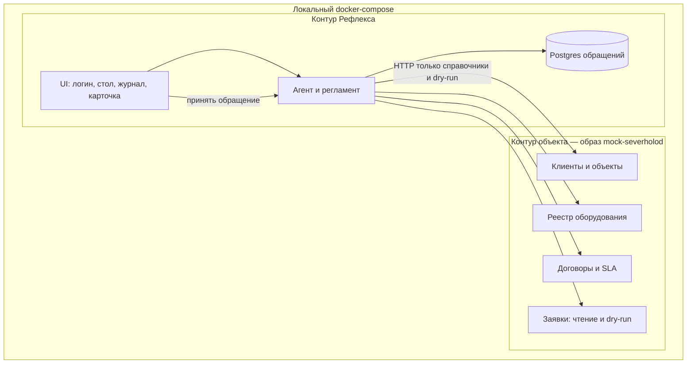
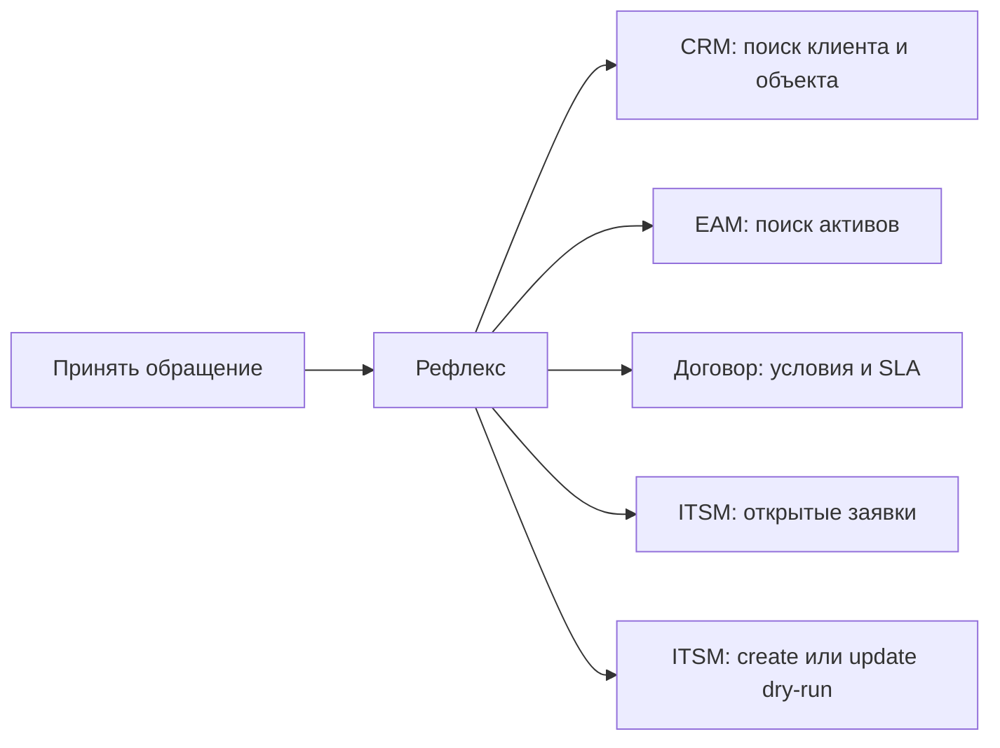
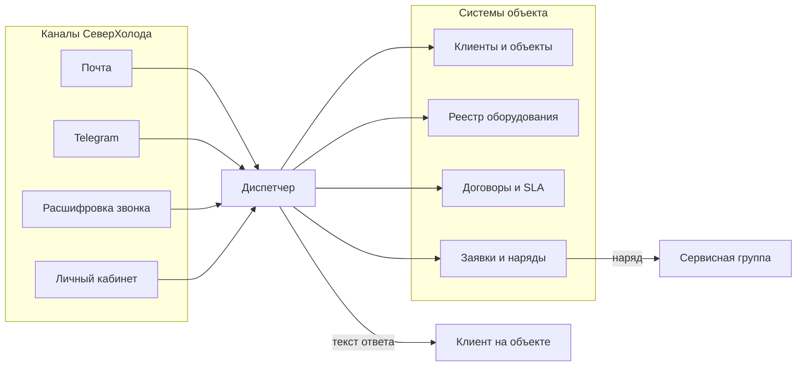
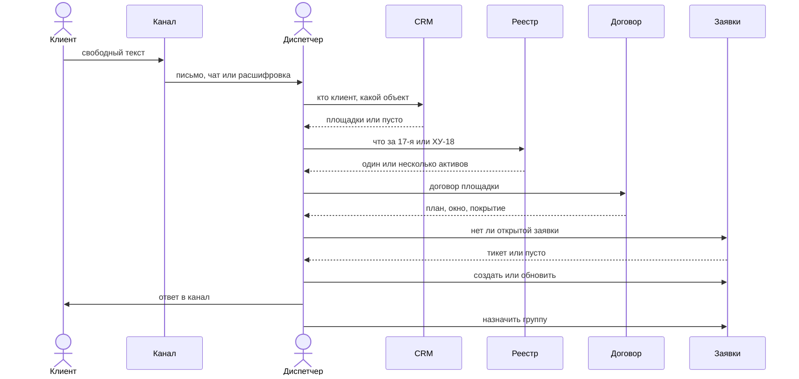
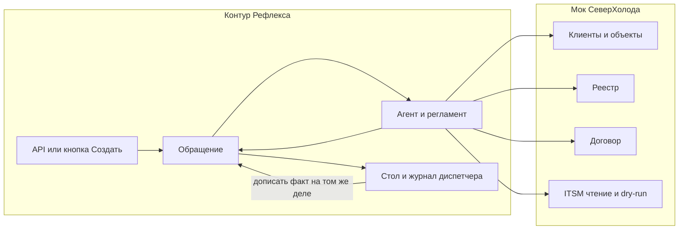
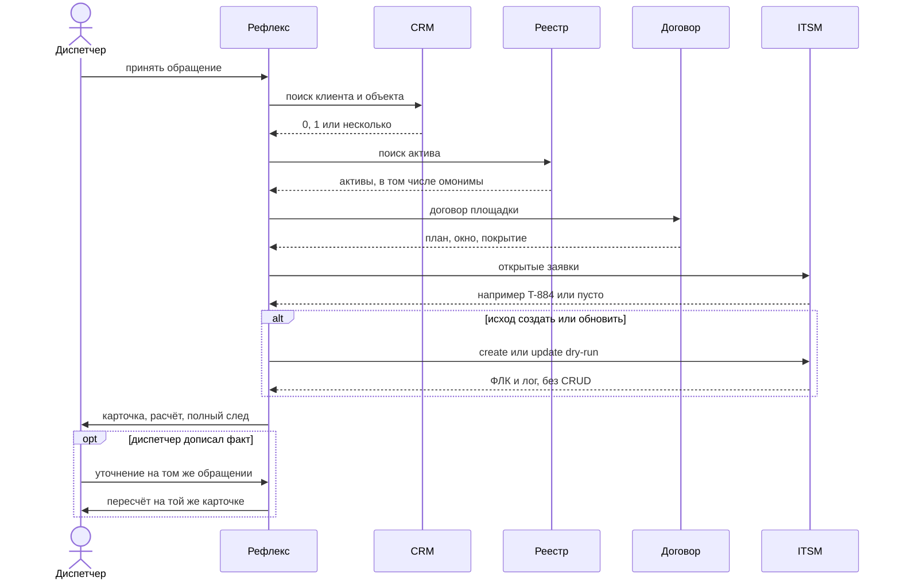

# Scope analysis: контур внедрения и место модуля

> Наш разбор as-is / to-be и границы контуров. Не заменяет `idea.md`, `vision.md` и не является ТЗ заказчика: пакет `docs/requirements/severholod/` пишется отдельно, после «ок» на этот файл.
>
> **Статус:** согласован. Следующий документ пакета — сопроводительное ТЗ.
> **Источник внешнего брифа:** [docs/requirements/task.md](../requirements/task.md).
> **Последнее обновление:** 2026-08-24.

---

## Зачем этот документ

Селектловское задание просит превратить свободный текст в контролируемое бизнес-действие. Мы не кладём справочники «в JSON рядом с агентом», а отделяем объект внедрения от модуля, который в него встраивается.

Объект внедрения в задании безымянный. Для мока это **«СеверХолод»**: сервис промышленного холода, в сидах по-прежнему клиенты «СеверФуд» и «Ритейл-Плюс». Заголовок задания «Text2Business» — имя брифа, не продукта.

Модуль называется **«Рефлекс»**. Это ИИ-диспетчерская: принимает обращение, ведёт разбор, решает, создавать заявку в ITSM или нет. В домене имя отсылает к рефрижераторному оборудованию; по смыслу — быстрая реакция, которую регламент всё ещё может остановить.

---

## 1. Два контура

Рефлекс стоит **рядом** с объектом, не внутри CRM. Локально это два контура в одном compose.

Контур СеверХолода — отдельный Docker-образ. В пилоте в нём нет inbox и нет коннекторов к почте, Telegram, звонкам и личному кабинету. Есть фасады тех систем, в которые диспетчер и так ходит руками: клиенты и объекты, реестр оборудования, договоры, заявки. Один процесс, несколько префиксов API, чтобы CRM не слилась с тикетами в один узел.

Контур Рефлекса — агент, регламент, карточка обращения, Postgres модуля и веб-интерфейс диспетчера. Вход в пилоте — наш метод «принять обращение» (им же кормим e2e) и та же форма за кнопкой «Создать обращение». Канал остаётся полем входа, не отдельной системой. Целевая схема позже: коннектор кладёт входящее в очередь, Рефлекс забирает тот же payload. Это упрощение пилота, не отказ от каналов у объекта.

В таблицы СеверХолода Рефлекс в пилоте не пишет. Вызов create/update — dry-run: мок принимает payload, гоняет формально-логический контроль, пишет лог и отвечает, прошла бы операция или нет. Живой CRUD включается только опцией конфига, по умолчанию выключен.

Хостинг не делаем. Наблюдаемость — Langfuse в контуре Рефлекса, не система заказчика.

Секреты LLM живут в контуре Рефлекса. Мок СеверХолода в интернет не ходит.

---

## 2. Что агент имеет право вызвать

Недостающие поля агент не додумывает: пишет пробел на карточку и, если без них нельзя безопасно завести заявку, оставляет обращение на уточнение или на диспетчере.

**Клиенты и объекты.** Поиск по имени, контакту, адресу. Отдаёт площадку, часовой пояс, `customer_id`. Две площадки одного клиента — честный список, не «наиболее вероятная».

**Реестр оборудования.** Актив, локальный код, тип, критичность, площадка. Два «ХУ-17» на Москве и Екатеринбурге мок отдаёт оба.

**Договоры.** План, окно, покрытие, срок реакции. Дедлайн и приоритет Рефлекс считает у себя по регламенту; мок только отдаёт сырые условия.

**Заявки.** Чтение открытых тикетов. Create и update в пилоте — только dry-run и лог ФЛК. Это не обогащение фактов, а проверка, принял бы ITSM такой payload.

Чего нет: inbox-ручек, исходящей отправки клиенту, склада, биллинга, геокодера, файлового хранилища, semantic RAG, LLM «со стороны заказчика». Проект ответа клиенту живёт на карточке обращения. Склейки писем по thread id нет: каждый вызов «принять обращение» рождает новое дело.

---

## 3. Как сейчас работает диспетчер

Это картина объекта, не пилотный вход Рефлекса. Каналы у СеверХолода есть. Сегодня они сходятся в голове человека.

На одно входящее уходит около двенадцати минут. Диспетчер сам ищет клиента и объект, оборудование, договор, открытые заявки, ставит приоритет, заводит или обновляет тикет, пишет ответ и передаёт группу. Ошибка обычно в развилке: не та площадка, не тот актив, не тот приоритет. Если в тексте «17-я» без города, человек либо уточняет, либо угадывает. Угадывание после внедрения должно стать видимым остановом, а не тихим выбором.

---

## 4. Как будет устроена работа после Рефлекса

Каналы объекта никуда не делись. В пилоте они не подключены: диспетчер (или e2e) подаёт тот же минимальный вход заданию — канал, текст, время, при необходимости текст вложения — через Рефлекс. На объекте позже это сделает коннектор и очередь.

Рождается **обращение** — наша сущность разбора. На ней живут факты, ответы систем, решение, расчёты, проект ответа, вопросы, предупреждения, вердикт «в проде это ушло бы автоматом / в проде нужен человек», и полный след: что вызывали, где была LLM, почему так. Заявка в ITSM — не синоним обращения. В пилоте заявки как живой записи нет, есть только результат dry-run.

### Вход и несклейка

Каждый вызов «принять обращение» — новое дело. Ответ клиента в тот же канал в пилоте не ищем и не мержим. Если человеку надо уточнить у клиента, он делает это вне Рефлекса и **дописывает факт в то же обращение**. Агент пересчитывает на этой же карточке. Для проверки этого ДАНО в датасете будут два соседних входа: сначала мало данных, затем тот же текст плюс недостающий факт — как два разных обращения, «якобы после допроса».

### Что агент делает с обращением

Сначала извлекает факты из текста (клиент, объект, оборудование, проблема, симптомы, срок, резерв, отсылки к прошлому) с источником, фрагментом, уверенностью и типом значения. Потом читает CRM, реестр, договор, открытые заявки. Потом применяет регламент.

Если объект однозначен и открытого тикета про тот же инцидент нет — исход **создать заявку**. Если нашли открытый тикет про тот же случай — сразу **обновить**, без вырожденного «хотели создать, потом отменили». Закрытый тикет автоматически не оживляем: это новая заявка или эскалация, правило будет в регламенте.

Если клиента или площадку нельзя выбрать безопасно (два «ХУ-17» без города) — **запросить уточнение**. Заявку «на всякий случай» на ясную площадку с неясным активом не заводим: это ДАНО.

Если формально всё опознано, но договор или срок запрещают обещанное действие (ремонт по Basic, «сегодня» при SLA «следующий рабочий день») — **отклонить автоматический write** и объяснить причину. Обращение при этом садится в статус **доп. согласование** или **диспетчеру**. Это не кнопка «агент не прав» и не пустой отказ «просто не сделали».

Вердикт auto / HITL на карточке — про будущий прод: по этому обращению автоматика выполнила бы write или остановилась бы. В пилоте write всё равно только dry-run.

Приоритет, SLA и дедлайн считаются по регламенту из договора, критичности актива и времени получения. На карточке виден не только результат, а формула, подставленные аргументы и оговорка, чего не хватает, чтобы досчитать. Диспетчер может дописать аргумент в диалоге обращения — расчёт повторяется.

---

## 5. Что в scope этого разбора и что нет

В scope: два контура; мок без inbox; вход через Рефлекс; сущность обращения со статусами и диалогом диспетчера; dry-run ITSM с ФЛК; видимая неопределённость; вердикт auto/HITL как прогноз прода; три сценария задания, свой негатив и пара кейсов без merge.

Вне scope пилота: живые каналы и очередь (только обещание в сопроводительном), склейка переписки, полноценная IAM, выкладка, настоящая CRM, склад и биллинг, semantic RAG, обучение своей модели, кнопка оценки «агент не прав», исходящая отправка клиенту.

Детали экранов — в функциональной спецификации пакета заказчика, не здесь. Контракты методов, формулы и датасет — в следующих файлах `docs/requirements/severholod/`, по одному, после «ок».

Каркас уже выбран в шапке проекта: Python, LangChain, OpenAI-клиент, PostgreSQL, локальный docker-compose.

---

## 6. Что закрыто этим документом

Имя модуля — Рефлекс. Inbox-ручки СеверХолода в пилоте не делаем. Склейки нет. Create только при однозначном объекте. Найденный открытый тикет — сразу update. Отказ auto-write — после полного опознания, если регламент запрещает. Диалог уточнения — внутри обращения. Методологический `idea.md` в этом проходе не пишем.

Следующий файл после «ок» — сопроводительное ТЗ СеверХолода: [docs/requirements/severholod/README.md](../requirements/severholod/README.md).
